# Java Programlama 2023-2024 bahar dönemi
**Burada bahsedilen tüm sınıfların ve daha fazlasının ilgili örnek kodları yukarıdaki yüklediğim `ornekler.java` dosyasında bulunmaktadır.**

## 1. `Random` Sınıfı
Java'da rastgele sayılar üretmek için kullanılan bir sınıftır. Bu sınıf, genellikle oyunlar, simülasyonlar, rastgele seçimler ve diğer birçok uygulama için rastgele sayılara ihtiyaç duyulan durumlarda kullanılır.

Kütüphanesini eklemek için şu kodu kullanabilirsiniz:
```java
import java.util.Random;
```

`main` metodunda kullanımı, 0,1 rakamları rastgele seçecek
```java
public static void main(String[] args) {
  Random rand = new Random();
  int num = rand.nextInt(2);
}
```

**sabit bir sayı ile kullanımı**


- `0 ile 10` arasında seçim yapmak için
```java
public static void main(String[] args) {
  final int MAX = 10;
  Random rand = new Random();
  int num = rand.nextInt(MAX) + 1;
}
```
- `5 ile 15` arasında seçim yapmak için

```java
final int MAX = 15;
final int MIN = 5;
Random rand = new Random();
int randomNumber = rand.nextInt((MAX - MIN) + 1) + MIN;
```

**Önemli metotlar**
```java
int randomNumber = rand.nextInt(100); // 0 ile 99 arasında rastgele bir tamsayı üretir
double randomDouble = rand.nextDouble(); // 0.0 ile 1.0 arasında rastgele bir ondalıklı sayı üretir
boolean randomBoolean = rand.nextBoolean(); // true veya false değerlerinden birini rastgele olarak üretir
float randomFloat = rand.nextFloat(); // 0.0 ile 1.0 arasında bir float sayı üretir.
```
---

## 2. `Scanner` Sınıfı
Java'da kullanıcıdan girdi almak için kullanılan bir sınıftır. Kullanıcıdan klavyeden girdi almak için yaygın olarak kullanılır. Scanner sınıfı, bir girdi akışı üzerinde işlem yapmak için çeşitli yöntemler sağlar ve bu yöntemlerle tamsayılar, ondalıklı sayılar, metin gibi farklı türlerde verileri okuyabiliriz.

Kütüphanesini eklemek için şu kodu kullanabilirsiniz:
```java
import java.util.Scanner;
```

`main` metodunda kullanımı, kullanıcıdan bir string değeri almak için kullanımı
```java
public static void main(String[] args) {
  Scanner scan = new Scanner(System.in);
  System.out.print("Enter your name : ");
  String name = scan.nextLine();
}
```

**Önemli metotlar**
```java
int number = scan.nextInt(); // Klavyeden bir tamsayı girdisi okur
double decimal = scan.nextDouble(); // Klavyeden bir ondalıklı sayı girdisi okur
String text = scan.nextLine(); // Klavyeden bir metin girdisi okur
Boolean bol = scan.nextBoolean(); // Bir boolean değer okur. Kabul edilen değerler "true" veya "false" (büyük/küçük harf duyarlı değildir).
float f = scan.nextFloat(); // Bir float değeri okur.
```

---

## 3. `DecimalFormat` Sınıfı
 Java'da sayıları biçimlendirmek için kullanılan bir sınıftır. Bu sınıf, özel sayı biçimlendirme desenleri kullanarak sayıları belirli bir biçimde biçimlendirmenizi sağlar. Örneğin, ondalık sayıları belirli bir sayıda basamakla veya belirli bir desende biçimlendirebilirsiniz.
 
Önemli bir nokta olarak, bu işlevin dönüş değeri `java.lang.String` türündedir

 
Kütüphanesini eklemek için şu kodu kullanabilirsiniz:
```java
import java.text.DecimalFormat;
```


`main` metodunda kullanımı, noktadan sonra 2 basamak kalacak şekilde yuvarlamak için kullanımı
```java
public static void main(String[] args) {
  DecimalFormat df = new DecimalFormat("#.##");
  double number = 123.456;
  System.out.println(df.format(number));
}
```

---

## 4. `NumberFormat` Sınıfı
Java'da sayıların biçimlendirilmesi için kullanılan bir sınıftır. Bu sınıf, sayıların biçimlendirilmesi ve yerel ayarlar göz önünde bulundurularak uygun biçimde görüntülenmesi için çeşitli yöntemler sağlar. Örneğin, sayıların virgül ile ayrılması, ondalık kısmın görüntülenmesi, binlik ayırıcının kullanılması gibi özellikler bu sınıf tarafından sağlanır.

Kütüphanesini eklemek için şu kodu kullanabilirsiniz:
```java
import java.text.NumberFormat;
```

`main` metodunda kullanımı, yüzde değerlerini biçimlendirmek için NumberFormat sınıfının bir örneğini döndürür, bunun için `getPercentInstance` metodu kullanılır.

```java
public static void main(String[] args) {
  double ratio = 0.75;
  NumberFormat nf = NumberFormat.getPercentInstance();
  System.out.println(nf.format(ratio)); // output: 75%
}
```

belirli bir biçimlendirme için şu kütüphane eklenmeli

```java
import java.util.Locale;
```

`Türk` standartlarına göre para birimi biçimlendirme
```java
public static void main(String[] args) {
  double amount = 1234.56; // Miktarı temsil eden örnek bir sayı
  
  // Türk biçimlendirme ayarlarına sahip bir para birimi biçimlendirme örneği oluştur
  NumberFormat turkishCurrencyFormat = NumberFormat.getCurrencyInstance(Locale.forLanguageTag("tr-TR"));
  
  // Miktarı Türk Lirası cinsinden biçimlendir
  String formattedAmount = turkishCurrencyFormat.format(amount);
  System.out.println("Biçimlendirilmiş Miktar: " + formattedAmount); // Output: Biçimlendirilmiş Miktar: 1.234,56 ₺
}
```

---
## 5. `IO` Sınıfı
Java'da IO (Input/Output) sınıfı, giriş/çıkış işlemlerini yönetmek için kullanılan bir sınıf kümesini ifade eder. Java'da IO sınıfı, veri akışlarını işlemek, `dosyalardan okuma/yazma yapmak`, ağ üzerinden veri iletişimi gerçekleştirmek gibi çeşitli giriş/çıkış işlemlerini kolaylaştırır.

Kütüphanesini eklemek için şu kodu kullanabilirsiniz:
```java
java.io.*;
```
`* işareti`, bu sınıfa ait tüm metotları tanımlamak anlamına gelmektedir.

Java dilinde `throws IOException` ifadesi, bir metodunun hata durumlarını belirtmek için kullanılır. Bu ifade, bir metodun içinde `IOException` adlı bir istisna (exception) fırlatılabileceğini gösterir. IOException, giriş/çıkış işlemleri sırasında ortaya çıkabilecek bir hata türüdür. Bu hata, dosya okuma/yazma işlemlerinde dosyanın bulunamaması, erişim izinlerinin olmaması gibi durumlarda ortaya çıkabilir.


Metodun kullanımı, metod imzasının hemen yanında yer alır.
```java
public static void URLDissector() throws IOException{
}
```

bir dosya okuma örneği:
Eğer java.IO sınıfa ait olan tüm metotları çağırmak istemezsek, sadece gerekli metodlar çağırmak istersek dosya okumak için bu şekilde yazbiliriz

gerekli tanımlamalar:
```java
import java.io.BufferedReader;
import java.io.FileReader;
import java.io.IOException;
```

`main` metodunda kullanımı, dosya.txt adlı bir dosyayı okumak için FileReader kullanılır

```java
public static void main(String[] args) {
  try {
          // Okunacak dosyanın yolunu belirtin
          String dosyaYolu = "dosya.txt";
    
          // FileReader ile dosyayı oku
          FileReader fileReader = new FileReader(dosyaYolu);
    
          // BufferedReader ile FileReader'ı kullanarak dosyayı satır satır oku
          BufferedReader bufferedReader = new BufferedReader(fileReader);
    
          // Dosyadan okunan satırı tutacak değişken
          String satir;
    
          // Dosya sonuna kadar oku ve her satırı konsola yazdır
          while ((satir = bufferedReader.readLine()) != null) {
            System.out.println(satir);
          }
    
          // Kullanılan kaynakları serbest bırak
          ufferedReader.close();
   } catch (IOException e) {
          ystem.out.println("Dosya okuma hatası: " + e.getMessage());
   }
}
```

### **`useDelimiter`** metodu:
bir Scanner nesnesinin girdi dizesini parçalamak için kullanılan bir deseni belirtmenizi sağlar. Yani, girdi dizesini belirli bir desene göre böler ve parçalara ayırır. Bu desen, bir karakter veya karakter dizisi olabilir.
Örneğin, bir metin dosyasındaki her satırı okurken, her satırı boşluk karakterine göre parçalamak istiyorsanız, useDelimiter metodunu boşluk karakteriyle çağırabilirsiniz:

```java
Scanner scanner = new Scanner(dosya);
scanner.useDelimiter(" ");
```
Bu durumda, her çağrıda next() veya nextLine() metodu, bir sonraki boşluk karakterine kadar olan kısmı döndürecektir. Bu şekilde, girdi dizesini istediğiniz şekilde parçalayabilir ve işleyebilirsiniz.

`useDelimiter` için bir örnek:

dosya.txt:
```txt
Java,Python,C++,JavaScript
HTML,CSS,JavaScript,TypeScript
C#,Java,Python,Ruby
```
`main` metodu:
```java
public static void main(String[] args) {
  try {
    String dosyaYolu = "dosya.txt";

    File dosya = new File(dosyaYolu);
    Scanner scanner = new Scanner(dosya);
    scanner.useDelimiter(",");

    while (scanner.hasNext()) {
      String token = scanner.next();
      System.out.println(token);
    }

    scanner.close();
    } catch (FileNotFoundException e) {
      System.out.println("Dosya bulunamadı: " + e.getMessage());
    }
}
```
Output:
```
Java
Python
C++
JavaScript
HTML
CSS
JavaScript
TypeScript
C#
Java
Python
Ruby
```
Dosya 3 satırdan oluşuyor ve her bir dil virgülle ayrılmış olarak yazılmış. Ancak çıktıda her bir satır hem satır başı karakterine hem de virgüle göre ayrılmış. UseDelimiter kullanılmasaydı, 3 satır olarak yazdırılacaktı.

**Önemli metotlar**
```java
// Metin dosyasından okuma ve yazma işlemleri için kullanılan sınıflar
import java.io.BufferedReader;
import java.io.BufferedWriter;
import java.io.FileReader;
import java.io.FileWriter;

// Dosya işlemleri için temel sınıf
import java.io.File;

// Bayt tabanlı giriş ve çıkış işlemleri için temel soyut sınıflar
import java.io.FileInputStream;
import java.io.FileOutputStream;
import java.io.InputStream;
import java.io.OutputStream;

// Karakter tabanlı giriş ve çıkış işlemleri için temel soyut sınıflar
import java.io.InputStreamReader;
import java.io.OutputStreamWriter;

// Yazdırma işlemleri için sınıf
import java.io.PrintWriter;

// Nesnelerin serileştirilmesi için arayüz
import java.io.Serializable;

// IO işlemlerinde oluşabilecek istisnalar için sınıf
import java.io.IOException;

```

---
## 6. `ArrayList` Sınıfı
- Bir ArrayList nesnesi, ihtiyaç duyulduğunda büyür ve küçülür, gerektiğinde kapasitesini ayarlar.
- ArrayList'in index değerleri 0'dan başlar.
- Ekleme ve silme işlemlerine göre indexler ayarlanır.

Kütüphanesini eklemek için şu kodu kullanabilirsiniz:
```java
import java.util.ArrayList;
```
Listede depolanan nesnenin türü, ArrayList nesnesi oluşturulurken belirlenir:
```java
ArrayList<String> names = new ArrayList<String>();
ArrayList<int> numbers = new ArrayList<int>();
ArrayList<Book> books = new ArrayList<Book>();
ArrayList<ogrenci> ogrenciler = new ArrayList<ogrenci>();
```
`Örnek:` Bir grup üyeleri listesini ArrayList içinde saklayan ve güncelleyen bir program:

```java
public static void main (String[] args)
{
  ArrayList<String> band = new ArrayList<String>();
  band.add("Paul");
  band.add("Pete");
  band.add("John");
  band.add("George");
  System.out.println(band);
  int location = band.indexOf("Pete");
  band.remove (location);
  System.out.println(band);
  System.out.println("At index 1: " + band.get(1));
  band.add(2, "Ringo");
  System.out.println("Size of the band: " + band.size());
  int index = 0;
  while (index < band.size())
  {
    System.out.println(band.get(index));
    index++;
  }
}
```

**Önemli metotlar**
```java

// ArrayList oluşturma
ArrayList<String> myList = new ArrayList<String>();

// boolean add(E obj): Belirtilen öğeyi listenin sonuna ekler.
boolean added = myList.add("Bashful");

// void add(int index, E obj): Belirtilen konuma belirtilen öğeyi ekler.
myList.add(1, "Sleepy");

// Object remove(int index): Belirtilen konumda bulunan öğeyi listeden kaldırır.
Object removed = myList.remove(0);

// Object get(int index): Belirtilen konumdaki öğeyi döndürür.
Object element = myList.get(0);

// boolean isEmpty(): Liste boş mu diye kontrol eder.
boolean empty = myList.isEmpty();

// int size(): Listenin boyutunu döndürür.
int size = myList.size();

```

---
## 6. `swing` Kütüphanesi
Java programlama dilinde GUI (Graphical User Interface - Grafiksel Kullanıcı Arayüzü) bileşenlerini oluşturmak için kullanılan bir kütüphanedir. Java'nın standart sınıf kitaplığının bir parçasıdır ve Java'nın platform bağımsız yapısıyla uyumlu olarak çalışır. Swing, pencere, düğme, metin kutusu gibi GUI bileşenlerini oluşturmanın yanı sıra, kullanıcı etkileşimine yönelik olayları işlemek ve farklı temalarda ve stillerde GUI'ler oluşturmak için birçok araç sağlar.

### **`JOptionPane`** sınıfı:
Java Swing kütüphanesinde bulunan ve temel iletişim kutuları oluşturmayı ve kullanmayı kolaylaştıran bir sınıftır. JOptionPane sınıfı, kullanıcıya bilgi iletmek, bir eylemi onaylamak veya kullanıcıdan bilgi almak gibi çeşitli amaçlarla kullanılabilir. Basit bir arayüze sahiptir ve kullanıcı dostu iletişim kutuları oluşturmak için kullanılabilir.

JOptionPane ile oluşturulan iletişim kutuları, metin içeriği, simgeler, düğmeler ve giriş alanları gibi çeşitli öğeler içerebilir. Kullanıcıya belirli bir mesajı iletmek veya belirli bir eylemi gerçekleştirmesini istemek için kullanılabilirler.

kütüphaneyi eklemek bu şekilde:
```java
import javax.swing.JOptionPane;
```

kütüphaneyi eklerken `The package javax.swing is not accessible` veya `The type import javax.swing.JOptionPane is not accessible` gibi hatalar çıkarsa çözümü bu şekilde olur:
```txt
Properties -> Java Build Path -> Libraries -> Modulepath -> Add Libraries... -> JRE System Library -> Next -> Execution environment: -> CDC-1.0/Foundation-1.0 (jdk-17.0.2) -> Finish -> Apply -> Apply and Close
```
Bu şekilde hata çözülmüş olur ve kütüphaneyi ekleyebilirsiniz, ancak bu adımları uyguladıktan sonra halihazır kodunuzda `Syntax error, varargs are only available if source level is 1.5 or greater` gibi hatasını alırsanız çözümü bu şekilde:
```txt
Properties -> Java Compiler -> Finally set the Compiler compliance level to 1.5 or more
```
Uyguladıktan sonra yine hata alıyorsanız projenizi `Rebuild` etmeyi deneyin.


`main` metodu: Kullanıcıdan bir sayı alarak, girilen sayının çift mi yoksa tek mi olduğunu kontrol eden ve sonucu kullanıcıya bildiren bir program
```java
public static void main(String[] args) {
  String numStr, result;
  int num, again;
    
  do {
    numStr = JOptionPane.showInputDialog("Enter an integer");
    num = Integer.parseInt(numStr);
      
    result = "That number is " + ((num % 2 == 0) ? "even" : "odd");
      
    JOptionPane.showMessageDialog(null, result);
    again = JOptionPane.showConfirmDialog(null, "Do Another?");
  } while (again == JOptionPane.YES_OPTION);
}
```

**Önemli metotlar**

`1. showInputDialog:` Belirtilen mesajı içeren bir giriş kutusu gösterir ve kullanıcıdan bir metin girmesini bekler. Kullanıcının girdiği metin geri döndürülür.
```java
static String showInputDialog(Object message) {
}
```
`2. showMessageDialog:` Belirtilen bileşenin altında bir iletişim kutusu görüntüler. Kullanıcıya bir mesaj göstermek için kullanılır.
```java
static void showMessageDialog(Component parent, Object message) {
}
```
`3. showConfirmDialog:` Belirtilen bileşenin altında bir onay kutusu görüntüler. Kullanıcıdan bir onay almak için kullanılır.
```java
static int showConfirmDialog(Component parent, Object message) {
}
```
`4. showOptionDialog:` Belirtilen bileşenin altında bir seçenek kutusu görüntüler. Kullanıcıdan bir seçenek seçmesini bekler.
```java
static int showOptionDialog(Component parent, Object message, String title, int optionType, int messageType, Icon icon, Object[] options, Object initialValue) {
}
```

---
## 7. `String` Sınıfı
- String bir değişken değildir, bir `objedir`
- `for` döngüsü içinde String'e ekleme işlemi yapmak, `çok maliyetli` bir yaklaşımdır.
- Bir String'in değeri çift tırnak içinde belirtilir: ` " `.
- Karakter (char) değişkenleri için tek tırnak içinde belirtilir: ` ' ` ve Stringler için kullanılmaz.
#### İki şekilde tanımlanabilir:
```java
String st = "Sarı Kırmızı, Ateş ve Aslan";
```

```java
String st = new String("Sarı Kırmızı, Ateş ve Aslan");
```

**Önemli metotlar**
* __`new` method:__ yeni obje üretmek için kullanılır.
```java
public static void main (String[] args)
{
  String takim1 = new String("Galatasaray");
  String takim2 = new String(takim1);
}
```
* __`charAt` method:__ bir karaktere ulaşmak için kullanılır. index'i integer olarak parametre alır.
```java
public static void main (String[] args)
{
  String takim = new String("Galatasaray");
  char c = takim.charAt(6);
  System.out.println(c); // Output: s
}
```

* __`compareTo` method:__ bir nesneyi diğerine göre sıralamak için kullanılır.

Java karakter verisi Unicode karakter kümesine dayanır. Unicode, her karakter için belirli bir sayısal değer belirler ve bu nedenle bir sıralama sağlar. Bu sıralamaya dayanarak karakter verileri üzerinde ilişkisel operatörler kullanabiliriz
| karakter | Unicode | 
| --------- | ------- | 
| 0 - 9     | 48 - 57 |  
| A - Z     | 65 - 90 | 
| a - z     | 97 - 122| 

Yukarıdaki tabloya göre bu sonuçları elde edebiliriz

```java
public static void main (String[] args)
{
int r;
  String takim1 = "Galatasaray";
  String takim2 = "Galatasaray";
		
  // iki string aynı ise 0 döndürür
  r = takim1.compareTo(takim2); // 0 döndürür
		
  takim1 = "Galatasaray";
  takim2 = "galatasaray";
		
  // Eğer parametre olan daha büyük Unicode'a sahipse, negatif bir değer döndürür
  r = takim1.compareTo(takim2); // Negatif bir değer döndürür

  takim1 = "galatasaray";
  takim2 = "Galatasaray";
		
  // Eğer parametre olan daha küçük Unicode'a sahipse, pozitif bir değer döndürür
  r = takim1.compareTo(takim2); // Pozitif bir değer döndürür		
}
```

* __`concat` method:__ iki stringi birleştirmek için kullanılır.
```java
public static void main (String[] args)
{
  String takim1 = "Galata";
  String takim2 = "saray";
	
  String takim = takim1.concat(takim2);
  System.out.println(takim); // Output: Galatasaray
}
```

* __`equals` method:__  iki nesnenin aynı olup olmadığını kontrol eder.
```java
public static void main (String[] args)
{
  String takim1 = "Galatasaray";
  String takim2 = "Galatasaray";
  
  boolean b = takim1.equals(takim2);
  System.out.println(b); // Output: true
}
```

* __`equalsIgnoreCase` method:__  iki String'i büyük harf-küçük harf farkını göz ardı ederek karşılaştırır.
```java
public static void main (String[] args)
{
  String takim1 = "Galatasaray"; // G büyük
  String takim2 = "galatasaray"; // g küçük
  
  boolean b1 = takim1.equals(takim2);
  System.out.println(b1); // Output: false
		
  boolean b2 = takim1.equalsIgnoreCase(takim2);
  System.out.println(b2); // Output: true
}
```

* __`length` method:__  bir String'in uzunluğunu döndürür.
```java
public static void main (String[] args)
{
  String takim = "Galatasaray"; 
  
  int length = takim.length();
  System.out.println(length); // Output: 11
}
```


* __`replace` method:__ bir String içinde belirtilen bir karakteri başka bir karakterle değiştirmek için kullanılır.
```java
public static void main (String[] args)
{
  String takim1 = "galatasaray"; 
		
  String takim2 = takim1.replace('g', 'G');
  System.out.println(takim2); // Output: Galatasaray
  
  String takim3 = takim1.replace('a','A');
  System.out.println(takim3); // Output: gAlAtAsArAy
}
```


* __`substring` method:__ bir String'in belirli bir aralığındaki karakterleri almak için kullanılır.
```java
public static void main (String[] args)
{
  String takim = "Galatasaray";
  
  String subTakim1 = takim.substring(6); // 7. indexten sonuna kadar
  System.out.println(subTakim1); // Output: saray
  
  String subTakim2 = takim.substring(3, 6); // 3 dahil, 6 dahil değil
  System.out.println(subTakim2); // Output: ata
}
```


* __`toLowerCase` method:__ bir String'in tüm harflerini küçük harfe dönüştürür.
```java
public static void main (String[] args)
{
  String takim1 = "GalataSaray"; // G ve S büyük harfler
  
  String takim2 = takim1.toLowerCase();
  
  System.out.println(takim2); // Output: galatasaray
}
```


* __`toUpperCase` method:__ bir String'in tüm harflerini büyük harfe dönüştürür.
```java
public static void main (String[] args)
{
  String takim1 = "Galatasaray"; // sadece G büyük harfler
  
  String takim2 = takim1.toUpperCase();
  
  System.out.println(takim2); // Output: GALATASARAY
}
```


# Aşağıdaki içerikte bir sorunla karşılaşırsanız Notion'da açmayı deneyebilirsiniz.
<div align='center' >
<a href="https://yasir-alrawi.notion.site/Java-Programlama-21b3cd87c17c4fe5b29082cd7d32eb68?pvs=4" target="_blank">
    
</a>
</div>

# 🏛️ Classes
Daha önce `Scanner`, `ArrayList` ve `String` gibi classları kullanıyorduk. Ancak şimdi kendi classlarımızı biz yazmaya başlayacağız.

Bir sınıf oluştururken, başlangıçta hangi özelliklerin alacağını ve hangilerinin zorunlu veya isteğe bağlı olduğunu belirlememiz gerekiyor. Dışarıdan erişilebilir olması gereken özellikleri genellikle `public` olarak tanımlarız. Ancak, dışarıdan erişilmemesini istediğimiz özellikleri `private` olarak tanımlarız ve bu özelliklere sadece sınıfın içinden erişim sağlarız.

Bazı özelliklerin dışarıdan değiştirilebilmesini isteyebiliriz, ancak bu durumda bile, Kapsülleme mantığından faydalanarak özelliği `private` olarak tanımlarız ve `set`/`get` metotlarıyla erişim sağlarız.

**Peki, neden bir değişkeni hemen `public` olarak tanımlayıp dışarıdan erişmesine izin verebilirken, bunu `private` olarak tanımlayıp `set` ve `get` metotları ile erişmeye açıyoruz?**

Aslında, her iki durumda da değişkene erişebiliriz. Ancak, bu yaklaşımlar arasında önemli bir fark var. Direkt olarak public olarak tanımlayıp atama yaparsak, hiçbir kısıtlama olmadan herhangi bir değer atanabilir ve bu güvenlik açısından risk oluşturabilir. Oysa ki, set metodu içinde değeri kontrol edip uygun kısıtlamaları sağladıktan sonra atanmasını sağlarız. Bu sayede, atama işlemi öncesinde veriyi kontrol edebilir ve gerekli güvenlik önlemlerini alabiliriz.

---

## Örnek

Bir zar düşünelim; bu zarın üst yüzü olduğunu ve her atışta rastgele bir değer alacağını biliyoruz. Ayrıca, elimizde hareket ettirerek istediğimiz değeri üst yüz yapabileceğimizi ve bu üst yüzün değerini görebileceğimizi varsayalım. Şimdi, bu zarı sınıflarla nasıl temsil edebiliriz?

### Tanımlama

Bir zar dediği için ben zar için bir sınıf oluşturmam gerek demek:

```java
class zar{

}
```

### Özellikleri Tanımlama

Üst yüzü için bir değişken tanımlamanın gerekliliğini hemen anlarız. Ancak, ek olarak 'MAX' adında bir değişken daha tanımlarsak işlemleri kolaylaştırırız. Bu 'MAX' değişkeninin sabit bir değeri olmalı, yani 6. Böylece, üst yüzün alabileceği maksimum değerin 6 olmasını sağlarız. Aynı zamanda bu değişkenler `private` olmalılar ki dışarıdan erişilmez olsunlar.

```java
class zar{
	private final int MAX = 6;
	private int ustYuz;
}
```

### Constructor ( Yapılandırıcı ) Metodu

Peki, `zar` sınıfından bir nesne ilk oluşturulduğunda, `ustYuz` değişkeninin değerini kullanıcıdan zorunlu olarak mı alacağımızı yoksa isteğe bağlı mı olacağını düşünebiliriz. Ayrıca, bu değeri kullanıcıdan mı alacağımızı yoksa varsayılan bir değer mi atayacağımızı da belirlemeliyiz. Bu örnekte, `zar` sınıfından bir nesne ilk üretildiğinde `ustYuz` değişkeninin değerini varsayılan olarak 1 olarak atayacağım.

```java
public zar() {
		ustYuz = 1;
}
```

### Atama Metodu

Atama metodu tanımlarken ilk bu metot bir değer mi döndürecek yoksa sadece işlem yapacak. Tanımlayacağımız metot sadece atama işlemini yapması gerektiği için onu `void` olarak tanımlayacağız.

```java
public void atama() {
	ustYuz = (int) (Math.random() * MAX) + 1;
}
```

`Math.random()` metodu 0 (dahil) ile 1 (hariç) arasında rastgele bir ondalık sayı üretir. MAX değişkenimizin değeri 6 ise `(Math.random() * MAX)` bu komut hiçbir zaman 6 üretemez çünkü 1 olamayacak ancak eğer ona `+ 1` yazarsak hem 6 değerini üretmiş olduk hem de 0 olma durumunu engellemiş oluruz.

### Set Metodu

Biz örnekte bu zarı elimizde hareket ettirerek istediğimiz değeri üst yüz yapabileceğimizi söylemiştir. işte onu istediğimiz değer atamak `set` demek oluyor.

```java
public void setUstYuzu(int ustYuz) {
	if (ustYuz <= MAX && ustYuz > 0)
		this.ustYuz = ustYuz;
}
```

Ancak elimizde hareket ettirdiğimizde sadece 1 ile 6 arasında üst yüzü yapabiliriz. Bu yüzden  atama yaparken kontrol etmemiz gerek.

### Get Metodu

Aynı zamanda üst yüzünü görebildiğimizi de söylemiştik işte bu da `get` metodu üst yüzünü görmemizi sağlayacaktır.

```java
public int getUstYuzu() {
	return ustYuz;
}
```

`getUstYuzu` metodu `ustYuzu` değerini getirir ancak ekrana yazdırmaz, üzerinde işlem yapmak için kullanılır.

### toString Metodu

Sınıftan bir nesne oluşturduğumuzda ve bu nesneyi yazdırdığımızda, üst yüzünün değerini görmek istiyoruz. Bu nedenle, `toString()` metodunu kullanarak bu değeri yazdıracağız.

```java
public String toString() {
	String sonuc = Integer.toString(ustYuz);
	return sonuc;
}
```

### zar Sınıfı

Yukarıda yazdığımız tüm kodları bir araya topladığımızda `zar` sınıfı bu şekilde olacaktır

```java
class zar {
	private final int MAX = 6;
	private int ustYuz;

	public zar() {
		ustYuz = 1;
	}

	public void atama() {
		ustYuz = (int) (Math.random() * MAX) + 1;
	}

	public void setUstYuzu(int ustYuz) {
		if (ustYuz <= MAX && ustYuz > 0)
			this.ustYuz = ustYuz;
	}

	public int getUstYuzu() {
		return ustYuz;
	}

	public String toString() {
		String sonuc = Integer.toString(ustYuz);
		return sonuc;
	}
}
```

### Main Metodu

Yukarıdaki sınıfı main metodunda kullanmak için bu şekilde kod yazabiliriz.

```java
public static void main(String[] args) {
		zar zar1, zar2; // zar sınıfınran 2 nesne türettik
		int toplam; // toplam zarların üst yüzünü saklamak için
		zar1 = new zar(); // bizinci zarı tanımladık
		zar2 = new zar(); // ikinci zarı tanımladık
		zar1.atama(); // birinci zarı attık
		zar2.atama(); // ikinci zarı attık
		System.out.println("Zar Bir: " + zar1 + ", Zar İki: " + zar2); // toString() metodundan yararlanarak onları yazdırabiliriz
		zar1.atama(); // birinci zarı tekrar attık
		zar2.setUstYuzu(4); // ikinci zarı elimiz ile üst yüzü 4 yaptık
		System.out.println("Zar Bir: " + zar1 + ", Zar İki: " + zar2); // toString() metodundan yararlanarak onları yazdırabiliriz
		toplam = zar1.getUstYuzu() + zar2.getUstYuzu(); // get metodundan yararlanarak iki zarın üst yüzleri toplayabildik
		System.out.println("Toplam: " + toplam); // toplamı yazdırabiliriz
		zar2.setUstYuzu(7); // setUstYuzu() metodunda yazdığımız kısıtlama dolayından 7 değeri atanamayacak ve 4 kalacaktır
		System.out.println("zar İki: " + zar2);
}
```

### Kodun Tamamı

hem main metodu hem zar sınıfı tamamen kod bu şekilde olacaktır

```java
public class ornek{

	public static void main(String[] args) {
		zar zar1, zar2; // zar sınıfınran 2 nesne türettik
        int toplam; // toplam zarların üst yüzünü saklamak için
        zar1 = new zar(); // bizinci zarı tanımladık
        zar2 = new zar(); // ikinci zarı tanımladık
        zar1.atama(); // birinci zarı attık
        zar2.atama(); // ikinci zarı attık
        System.out.println("Zar Bir: " + zar1 + ", Zar İki: " + zar2); // toString() metodundan yararlanarak onları yazdırabiliriz
        zar1.atama(); // birinci zarı tekrar attık
        zar2.setUstYuzu(4); // ikinci zarı elimiz ile üst yüzü 4 yaptık
        System.out.println("Zar Bir: " + zar1 + ", Zar İki: " + zar2); // toString() metodundan yararlanarak onları yazdırabiliriz
        toplam = zar1.getUstYuzu() + zar2.getUstYuzu(); // get metodundan yararlanarak iki zarın üst yüzleri toplayabildik
        System.out.println("Toplam: " + toplam); // toplamı yazdırabiliriz
        zar2.setUstYuzu(7); // setUstYuzu() metodunda yazdığımız kısıtlama dolayından 7 değeri atanamayacak ve 4 kalacaktır
        System.out.println("zar İki: " + zar2); // 4 olarak göreceğiz
	}
}

class zar {
	private final int MAX = 6;
	private int ustYuz;

	public zar() {
		ustYuz = 1;
	}

	public void atama() {
		ustYuz = (int) (Math.random() * MAX) + 1;
	}

	public void setUstYuzu(int ustYuz) {
		if (ustYuz <= MAX && ustYuz > 0)
			this.ustYuz = ustYuz;
	}

	public int getUstYuzu() {
		return ustYuz;
	}

	public String toString() {
		String sonuc = Integer.toString(ustYuz);
		return sonuc;
	}
}
```

## Sorular

### Bir sınıf ile bir nesne arasındaki ilişki nedir?

Bir sınıf bir nesnenin tanımı, şablonu veya mavzolugudur. Bir nesne tarafından yönetilecek verileri tanımlar, ancak bunun için bellek alanı ayırmaz. Bir sınıftan birden çok nesne oluşturulabilir ve her bir nesnenin kendi örneğine ait veri kopyası vardır.

### Özellikler nerede tanımlanır?

Özellikler: değişkenler ve metotlar Sınıf seviyesinde tanımlanır.

### Yerel değişken nedir?

Yerel veri, bir metot içinde tanımlanır ve sadece o metotte erişilebilir.

### **Neden `ustYuz` değişkeni `private` olarak tanımlandı?**

`ustYuz` değişkenini `private` yapmamızın nedeni, sadece sınıfın sağladığı belirli metodlar aracılığıyla değiştirilmesine olanak tanımaktır. Bu şekilde, sınıfın içindeki belirlediğimiz kısıtlamalara uygun değerler atanabilir. Ancak, belirlenen kısıtlamaları sağlamayan bir değer atanmaya çalışırsa, bu atanma işlemi gerçekleştirilmez.

### Neden `MAX` değişkeni sabit olarak tanımlandı?

Kapsülleme ihlal edilmemesi için `MAX` sabit bir değer olarak atanır; ayrıca, zarın en yüksek değeri 6'dır.

---

---

---

# Kapsülleme

Bir nesnenin iç detaylarının istemciye gizlenmesini sağlayan bir programlama prensibidir.

Bir siyah kutu gibi düşünebilirsiniz. İstemci, sadece nesnenin arayüz metotlarını çağırır ve bu metotlar, nesnenin iç verilerini yönetir. İstemcinin nesnenin iç yapısı hakkında hiçbir bilgisi olmaz, sadece nesnenin sağladığı hizmetlere erişir.

### **Üç Temel Görünürlük Belirteci**:

- **`public`**: Tüm sınıflardan ve paketlerden erişilebilir ( her yerden ).
- **`private`:**  Sadece tanımlandığı sınıf içerisinden erişilebilir.
- `protected`: Aynı paket içerisinden ve alt sınıflardan (inheritance) erişilebilir.

**Eğer herhangi bir erişim belirteci belirtilmezse (yani belirteç belirtilmezse), bu durumda öğe `*default (package-private)*` olarak kabul edilir. Bu durumda, sadece aynı paketten erişim mümkündür. Erişim belirtecinin açıkça belirtilmediği durumlarda kullanılır.**

- Sabitler **`public`** olarak tanımlanabilir, ancak değişkenlerin **`public`** olarak tanımlanması önerilmez.

## **Getter ve Setter**

- Erişimci metodlar `getter` olarak adlandırılır.
- Mutatör metodlar `setter` olarak adlandırılır.

<aside>
💡 Bu metodlar, kapsülleme ilkesini korurken, sınıf dışından özel verilere güvenli bir şekilde erişim ve bu verilerin değiştirilmesini sağlar.

</aside>

### Otomatik Olarak Getter ve Setter Oluşturma

Böyle **`x`** ve **`y`** alanlarına sahip bir sınıfımız olsun:

```java
class ClassName {
	private int x, y;
}
```

Onun **`getter`** ve **`setter`** metotlarını yazmak istersek, bunları **`Eclipse`** ayarlarından **otomatik** olarak oluşturabiliriz.


Mouse ile sağ tıklayıp **`source`** -> **`Generate Getters and Setters …`** seçeneğini seçtikten sonra bu pencere gösterilecektir:


Bu pencerede hangi değişkenler için **`getter`** ve **`setter`** metotlarını oluşturmak istediğimizi işaretleriz. Ardından `Genrate` buttonuna tıklayarak oluşturmuş oluruz.

### Otomatik Olarak Constructor Oluşturma

Bir sınıf için **`Eclipse`** ayarlarından **otomatik** olarak constructor oluşturabiliriz.


Mouse ile sağ tıklayıp **`source`** -> `Generate Constructor using Fields …` seçeneğini seçtikten sonra bu pencere gösterilecektir:


Bu pencerede, constructor içinde parametre olarak alınmasını istediğimiz değişkenleri işaretleriz. Ardından `Genrate` buttonuna tıklayarak oluşturmuş oluruz.

---

---

---

# Yazılım Geliştiricisinin Yapması Gereken Faaliyetler

## Program geliştirmenin dört temel faaliyeti

- Gereksinimleri Belirleme
- Tasarım Oluşturma
- Kodları Uygulama
- Uygulamanın Test Edilmesi

- **Gereksinimler:**
    - Yazılım gereksinimleri, bir programın gerçekleştirmesi gereken görevleri belirler.
    - Gereksinimler, ne yapılacağını, nasıl yapılacağını değil belirtir.
    - Genellikle başlangıçta bir gereksinim kümesi sağlanır, ancak bunlar eleştirilmeli ve genişletilmelidir.
    - Detaylı, belirsizliği olmayan ve eksiksiz gereksinimler belirlemek zor olabilir.
    - Gereksinimlere dikkatli bir şekilde dikkat etmek, genel proje sürecinde önemli zaman ve maliyet tasarrufu sağlayabilir.
    
- **Uygulama**:
    - Uygulama, bir tasarımın kaynak kodlara çevrilme sürecidir.
    - Acemi programcılar genellikle kod yazmanın yazılım geliştirmenin özü olduğunu düşünürler, ancak aslında bu en az yaratıcı adım olmalıdır.
    - Hemen hemen tüm önemli kararlar gereksinimler ve tasarım aşamalarında alınır.
    - Uygulama, kodlama detaylarına, stil kılavuzlarına ve belgelendirmeye odaklanmalıdır.

- **Tasarım**:
    - Yazılım tasarımı, bir programın gereksinimlerini nasıl gerçekleştireceğini belirtir.
    - Bir yazılım tasarımı, çözümün nasıl yönetilebilir parçalara ayrılabileceğini ve her parçanın ne yapacağını belirtir.
    - Nesne yönelimli bir tasarım, hangi sınıfların ve nesnelerin gereksinim duyulduğunu belirler ve bunların nasıl etkileşimde bulunacaklarını belirtir.
    - Düşük seviyeli tasarım detayları, bireysel metotların görevlerini nasıl gerçekleştireceğini içerir.
    
- **Test Etme**:
    - Test etme, programın gereksinimlerde belirtilen tüm kısıtlar altında amaçlanan sorunu çözeceğinden emin olmaya çalışır.
    - Bir program hataları bulma amacıyla titizlikle test edilmelidir.
    - Hata ayıklama, bir sorunun nedenini belirleme ve düzeltme sürecidir.
    

## **Sınıflar ve Nesneleri Belirleme**

Nesne yönelimli tasarımın temel etkinliği, çözümü oluşturacak sınıfları ve nesneleri belirlemektir. Sınıflar genellikle bir sınıf kitabından (class library) gelir, önceki bir projeden yeniden kullanılır veya yeni yazılır. Potansiyel sınıfları belirlemenin bir yolu, gereksinimlerde tartışılan nesneleri belirlemektir. Nesneler genellikle isimlerdir ve bir nesnenin sağladığı hizmetler genellikle fiillerdir.

### Örnek Bir Vaka Çalışması

- Bir öğrenci dört ders alabilir. Öğrencinin adı, soyadı, kimlik numarası ve adres bilgileri bulunmaktadır. Öğrenci, bir kurs hakkında arkadaşlarına bilgi verebilir.
- Öğrencinin üç başka öğrenci arkadaşı olabilir. Öğrenci, notları hakkında bilgi verebilir.
- Öğretmen, 20 öğrenciye ders verir. Sınıfındaki öğrencilere not verir.

---

## Bilgiler

- Bir sınıfın, aynı davranışlara sahip nesnelerin bir grubunu temsil ettiğini hatırlayın.
- Genellikle, nesneleri temsil eden sınıflara tekil isimler verilmelidir.
- Örnekler: Para, Öğrenci, Mesaj
- Bir sınıf, bir tane böyle bir nesnenin kavramını temsil eder.
- İhtiyaca göre her nesnenin istediğimiz kadar örneğini oluşturabiliriz.

---

- Bazı durumlarda, bir şeyin bir sınıf olarak temsil edilip edilmeyeceğine karar vermek zor olabilir.
- Örneğin, bir çalışanın adresi, bir dizi örnek değişkeni olarak mı yoksa bir Adres nesnesi olarak mı temsil edilmelidir?
- Problemi ve detaylarını ne kadar inceleyip analiz ederseniz, bu konular o kadar açık hale gelir.
- Bir sınıf çok karmaşık hale geldiğinde, genellikle sorumlulukları dağıtmak için birden fazla daha küçük sınıfa parçalanmalıdır.

---

- Doğru düzeyde ayrıntıya sahip sınıflar tanımlamak istiyoruz.
- Örneğin, bir evdeki her tür cihaz için ayrı sınıflar oluşturmak gereksiz olabilir.
- Daha genel bir Cihaz sınıfı tanımlamak, uygun örnek verileriyle yeterli olabilir.
- Her şey çözülen problemle ilgili detaylara bağlıdır.

---

- İhtiyaç duyduğumuz sınıfları belirlemenin bir parçası, her bir sınıfa sorumluluk atama sürecidir.
- Bir programın gerçekleştirmesi gereken her etkinlik, bir veya daha fazla yöntemle bir veya daha fazla sınıf tarafından temsil edilmelidir.
- Genellikle yöntemlerin isimlerinde fiiller kullanırız.
- Erken aşamalarda her sınıfın her yöntemini belirlemek gerekli değildir - ana sorumluluklarla başlayın ve tasarımı geliştirin.

---

---

---

# Static Değişkenler ve Metotlar

Static metotlar veya değişkenler sınıftan bir nesne türetmeden çağrılabilir. Sınıfın ismini kullanarak onlara erişilebilir.

Hepimiz `Math` sınıfını kullanmışızdır. onun içerdiği metotlara göz atarsak:

1. **`abs(x)`**: Bir sayının mutlak değerini döndürür.
2. **`sqrt(x)`**: Bir sayının karekökünü döndürür.
3. **`pow(x, y)`**: Bir sayının belirli bir üs kuvvetini hesaplar.
4. **`sin(x)`**, **`cos(x)`**, **`tan(x)`**: Bir açının sinüs, kosinüs ve tanjant değerlerini döndürür.
5. **`max(x, y)`**, **`min(x, y)`**: İki sayıdan büyük veya küçük olanı döndürür.
6. **`ceil(x)`**, **`floor(x)`**: Bir ondalıklı sayıyı yukarı veya aşağı yuvarlar.
7. **`random()`**: 0 ile 1 arasında rastgele bir ondalıklı sayı üretir.

Ancak onları kullanırken `Math math = new Math()` diye bir satır **yazmıyoruz**. Hemen Bu şekilde kullanabiliriz.

```java
result = Math.sqrt(25); // output: 5
```

## ⭐ Önemli Açıklama ⭐

**Sınıf içinde bir değişken tanımladığımızda ve bu sınıftan birden fazla nesne türettiğimizde, genellikle her nesne için ayrı bir değişken oluşur ve her nesne için farklı olabilir. Ancak, statik değişkenler tüm nesneler için aynıdır ve bir statik değişkenin değeri herhangi bir nesnede değiştirildiğinde, diğer tüm nesnelerde de değişir. Statik bir değişkenin bellek alanı, sınıf ilk kez referans alındığında oluşturulur.**

## Tanımlama

Statik değişkenler bu şekilde tanımlanabilir:

```java
private static float price;
```

Statik metotlar bu şekilde tanımlanabilir:

```java
public class Helper {
	public static int cube(int num) {
		return num * num * num;
	}
}
```

ve onu kullanmak istediğimizde kullanım şekli böyledir:

```java
value = Helper.cube(4); // output: 64
```

**`Halper halper = new Halper();` yazmamıza gerek yoktur:**

## ⭐ Önemli Bilgi ⭐

`araba` diye bir sınıfımız olsun, içinde `sahip` değişkeni, `hareket()` metodu olsun

```java
class araba{
	private String sahip;
	public static void hareket() {
		System.out.println(sahip);
	}
}
```

`sahip` değişkeni normal bir değişken olduğu için her nesne için farklı değerler alabilmişken `hareket` metodu tüm nesneler için aynıdır ve bir nesneye bağlı olmadan doğrudan sınıf adıyla çağrılır.  Dolayısıyla, `hareket` metodu içinde hangi nesnenin sahip değişkenine erişeceğini belirlemek mümkün değildir, bu da hata ile sonuçlanır.

## Static Değişkenleri ve Metotları Kullanımı

slogan diye bir sınıfımız olsun, bu sınıftan kaç nesne türetildiğini hesaplamak istiyorum, işte hesaplamak için statik değişkenleri kullanmam gerek:

**Slogan Sınıfı:**

```java
class Slogan {
	private String ifade;
	private static int adet = 0;

	//----------------------------------------------------------------
	// Yapılandırıcı: Sloganı ayarlar ve oluşturulan örneklerin sayısını sayar.
	//----------------------------------------------------------------
	public Slogan(String str) {
		ifade = str;
		adet++;
	}

	//----------------------------------------------------------------
	// Bu sloganı bir dize olarak döndürür.
	//----------------------------------------------------------------
	public String toString() {
		return ifade;
	}

	//----------------------------------------------------------------
	// Bu sınıfın oluşturulan örneklerinin sayısını döndürür.
	//----------------------------------------------------------------
	public static int getAdet() {
		return adet;
	}
}
```

Main Metodu:

```java
	public static void main(String[] args) {
	
		Slogan slogan1 = new Slogan("Hello World");
		Slogan slogan2 = new Slogan("Merhaba Dunya");
		
		System.out.println(slogan1); // Hello World
		System.out.println(Slogan.getAdet()); // 2
		Slogan slogan3;
		System.out.println(Slogan.getAdet()); // 2
	}
```

fark edersek `getAdet()` metodunu çağırdığımızda nesne adıyla değil sınıf adıyla çağırdık.

---

---

---

# Class Relationships (Sınıf ilişkileri)

Bir yazılım sistemindeki sınıflar, birbirlerine çeşitli ilişki türlerine sahip olabilirler.

## Java'da en yaygın üç ilişki türü

- **Dependency(Bağımlılık)**: A uses B
- **Aggregation(Birleşim)**: A has-a B
- I**nheritance(Kalıtım)**: A is-a B

## ⚪ **Dependency Nedir?**

bir sınıfın diğer bir sınıfa, genellikle onun metotlarını çağırarak, bir şekilde bağımlı olduğu durumdur. Bu ilişki, yazılım tasarımında yaygın olarak karşılaşılan bir durumdur. İyi bir tasarım, gereksiz karmaşıklığı önlerken doğru bağımlılıkları korur. Ayrıca, bazı durumlarda bir sınıf kendi içindeki nesneler arasında da bağımlılık gösterebilir. Bu durumda, sınıfın bir metodu, aynı sınıfın başka bir nesnesini parametre olarak kabul edebilir.

### Örnek

Bir kesirli sayı düşünelim, onu başka kesirli bir sayı ile toplayabiliriz veya çarpabiliriz gibi dört işlem, aynı zamanda bir kesirli sayıyı sadeleştirebiliriz. tersini alabiliriz.

Kesirli sayıyı temsil eden bir sınıf oluşturalım ve kesirli bir sayı üzerinde yapılan tüm işlemleri gerçekleştirelim.

Ayrıca sınıfı oluştururken `Bağımlılık` ilişkisini kullanarak daha performanslı bir şekilde oluşturalım.

**Tanımlama:**

İlk önce herhangi kesirli bir sayı iki temel özelliği var oda `pay` ve `payda` , onu tanımlama ile başlayalım.

```java
class KesirSayi {
	private int pay, payda;
}
```

**Constructor ( Yapılandırıcı ) Metodu:**

Bir kesirli sayı oluştururken, kesrin pay ve paydasını belirtmek zorundayız ki kesirli bir sayı elde edelim. Bu değerleri sınıfı ilk oluşturduğumuz anda almalıyız. Ayrıca, payda değerinin 0 olamayacağını kontrol etmeliyiz.

```java
public KesirSayi(int pay, int payda) {
	if (payda == 0)
		payda = 1;

	if (payda < 0) {
		pay = pay * -1;
		payda = payda * -1;
	}

	this.pay = pay;
	this.payda = payda;

	sadelestir();
}
```

`sadelestir()` metodu kesirli bir sayı ilk oluşturulduğunda en sade halinin üzerinde işlem yapmayı sağlar. Başka bir metot yapılandırıcı metodun içinde kullanmak Bağımlılık prensibini kullanmış oldum ve işlemi tekrar yapmak yerine sadece bu metodu çağırarak performansı yükseltmiş olduk.

**Sadeleştir:**

Bir kesrin sadeleştirilmesi, `pay` ve `payda` arasındaki en büyük ortak böleni bulup her ikisinin de bu değere bölünmesiyle gerçekleşir, böylece kesir en basit hâline getirilir.

İki sayının arasında en büyük ortak böleni (`ebob`) bulmak için bu metodu kullanacağız:

```java
private int ebob(int sayi1, int sayi2) {
	while (sayi2 != 0) {
		int temp = sayi2;
		sayi2 = sayi1 % sayi2;
		sayi1 = temp;
	}
	return sayi1;
}
```

Bu algoritmaya `Euclid` algoritması denir.

İşte pay ile payda arasındaki ebob bulduktan sonra sadece pay ve paydayı ortak bölen ile bölmemiz kalır.

```java
	private void sadelestir() {
		if (pay != 0) {
			int ortak = ebob(Math.abs(pay), payda);
			pay = pay / ortak;
			payda = payda / ortak;
		}
	}
```

pay sıfır olma durumunu maliyet açısından kontrol ettik, boşuna ebob metoduna gidip gereksiz işlem yapılmasın diye.

**Kapsülleme:**

`Pay` ve `payda` değerlerini sınıf içinde private olarak tanımladık, ancak bazı durumlarda bu değerlere erişmemiz gerekebilir. Bu nedenle, bu değerlere erişmek için bir erişimci metot (getter) tanımlamamız gerekir.

```java
public int getPay() {
	return pay;
}
```

`Pay` değerine erişmek için kullanılır.

```java
public int getPayda() {
	return payda;
}
```

`Payda` değerine erişmek için kullanılır.

**Kesrin Tersi:**

Kesrin tersi, orijinal kesrin pay ve paydasının yer değiştirmesi anlamına gelmez mi ? Yani, pay paydaya, payda ise paya yazılır. Bu işlemi basitçe şu şekilde ifade edebiliriz.

```java
public KesirSayi tersi() {
	return new KesirSayi(payda, pay);
}
```

**Toplama İşlemi:**

Matematik derslerinden bildiğimiz gibi iki kesrin toplanması bu şekilde olur

$$
\cfrac{pay1}{payda1} + \cfrac{pay2}{payda2} =
\cfrac{pay1*payda2 + pay2*payda1}{payda1*payda2}
$$

İşte kod ile temsil edersek bu şekilde olur:

```java
public KesirSayi topla(KesirSayi op2) {
	int pay1 = pay * op2.getPayda() + op2.getPay() * payda;
	int payda1 = payda * op2.getPayda();
	return new KesirSayi(pay1, payda1);
}
```

Burada eğer daha önce getter metotlarını tanımlamadıysak gelen kesrin payına ve paydasına erişemeyecektik. Bu noktada da fark edersek `Bağımlılık` vardır.

**Çıkarma İşlemi:**

Matematik derslerinden bildiğimiz gibi iki kesrin çıkarılması bu şekilde olur

$$
\cfrac{pay1}{payda1} - \cfrac{pay2}{payda2} =
\cfrac{pay1*payda2 - pay2*payda1}{payda1*payda2}
$$

Fark edersek toplamı işlemi ile farkı sadece ikinci kesrin payı ters işaretli olması. Bu nedenle biz toplama metodunu kullanarak çıkarma işlemini gerçekleştirebiliriz.

```java
public KesirSayi cikar(KesirSayi op2) {
	KesirSayi k = new KesirSayi(op2.getPay() * -1, op2.getPayda());
	return topla(k);
}
```

**Çarpma İşlemi:**

Matematik derslerinden bildiğimiz gibi iki kesrin çarpılması bu şekilde olur

$$
\cfrac{pay1}{payda1} * \cfrac{pay2}{payda2} =
\cfrac{pay1*pay2}{payda1*payda2}
$$

İşte kod ile temsil edersek bu şekilde olur:

```java
public KesirSayi carp(KesirSayi op2) {
	int pay = this.pay * op2.getPay();
	int payda = this.payda * op2.getPayda();
	return new KesirSayi(pay, payda);
}
```

**Bölme İşlemi:**

Matematik derslerinden bildiğimiz gibi iki kesrin bölünmesi birinci kesri ikinci kesrin tersiyle çarpılmasıyla elde edilir.

$$
\cfrac{pay1}{payda1} ÷ \cfrac{pay2}{payda2} =
\cfrac{pay1}{payda1} * \cfrac{payda2}{pay2}
$$

Ve benim tersi alan, çarpma işlemi yapan metotlarım var, onları kullanarak bölme işlemi yeni kodlar yazmadan gerçekleştirebilirim.

```java
public KesirSayi bol(KesirSayi op2) {
	return carp(op2.tersi());
}
```

**Karşılaştırma İşlemi:**

İki kesrin eşit olup olmadığını öğrenmek için payların ve paydaların eşitliğini kontrol edeceğiz.

```java
public boolean esitMi(KesirSayi op2) {
	return (pay == op2.getPay() && payda == op2.getPayda());
}
```

Bir kesir için bir nesne ilk oluşturulduğunda sadeleştirdiğimiz için $\cfrac{9}{12} = \cfrac{3}{4}$  sadeleştirilmemiş olsa da doğru sonuç verecektir.

**toStirng Metodu:**

Bir kesir için oluşturulan nesneyi yazdırınca kesrin ne olduğunu yazdıran metottur

```java
public String toString() {
	String sonuc;
	if (pay == 0)
		sonuc = "0";
	else if (payda == 1)
		sonuc = pay + "";
	else
		sonuc = pay + "/" + payda;
	return sonuc;
}
```

**KesirSayi Sınıfın Tam Kodu:**

```java
class KesirSayi {
	private int pay, payda;

	public KesirSayi(int pay, int payda) {
		if (payda == 0)
			payda = 1;

		if (payda < 0) {
			pay = pay * -1;
			payda = payda * -1;
		}

		this.pay = pay;
		this.payda = payda;

		sadelestir();
	}

	public int getPay() {
		return pay;
	}

	public int getPayda() {
		return payda;
	}

	public KesirSayi tersi() {
		return new KesirSayi(payda, pay);
	}

	public KesirSayi topla(KesirSayi op2) {
		int pay1 = pay * op2.getPayda() + op2.getPay() * payda;
		int payda1 = payda * op2.getPayda();
		return new KesirSayi(pay1, payda1);
	}

	public KesirSayi cikar(KesirSayi op2) {
		KesirSayi k = new KesirSayi(op2.getPay() * -1, op2.getPayda());
		return topla(k);
	}

	public KesirSayi carp(KesirSayi op2) {
		int pay = this.pay * op2.getPay();
		int payda = this.payda * op2.getPayda();
		return new KesirSayi(pay, payda);
	}

	public KesirSayi bol(KesirSayi op2) {
		return carp(op2.tersi());
	}

	public boolean esitMi(KesirSayi op2) {
		return (pay == op2.getPay() && payda == op2.getPayda());
	}

	public String toString() {
		String sonuc;
		if (pay == 0)
			sonuc = "0";
		else if (payda == 1)
			sonuc = pay + "";
		else
			sonuc = pay + "/" + payda;
		return sonuc;
	}

	private void sadelestir() {
		if (pay != 0) { 
			int ortak = ebob(Math.abs(pay), payda);
			pay = pay / ortak;
			payda = payda / ortak;
		}
	}

	private int ebob(int sayi1, int sayi2) {
		while (sayi2 != 0) {
			int temp = sayi2;
			sayi2 = sayi1 % sayi2;
			sayi1 = temp;
		}
		return sayi1;
	}
}
```

**Main Metodu:**

```java
public static void main(String[] args) {
		KesirSayi k1 = new KesirSayi(9, 12);
		KesirSayi k2 = new KesirSayi(3, 4);
		KesirSayi k3, k4, k5, k6, k7;

		System.out.println("Birinci kesir: " + k1);
		System.out.println("Ikinci kesir: " + k2);

		k3 = k1.topla(k2);
		k4 = k1.cikar(k2);
		k5 = k1.carp(k2);
		k6 = k1.bol(k2);
		k7 = k1.tersi();

		System.out.println("Toplam: " + k3);
		System.out.println("Fark: " + k4);
		System.out.println("Çarpım: " + k5);
		System.out.println("Bölüm: " + k6);
		System.out.println("Ters: " + k7);

		System.out.println("K1 ve K2 " + (k1.esitMi(k2) ? "Eşittir" : "Eşit Değildir"));
	}
```

**Kodun Çıktısı:**

```java
***Birinci kesir: 3/4
Ikinci kesir: 3/4
Toplam: 3/2
Fark: 0
Çarpım: 9/16
Bölüm: 1
Ters: 4/3
K1 ve K2 Eşittir***
```

---

## ⚪ **Aggregation Nedir?**

Aggregation (Toplama veya Birleştirme) bir nesnenin diğer nesnelerden oluştuğu durumu ifade eder. Java'da, bu ilişki genellikle "has-a" (sahip olma) ilişkisi olarak adlandırılır. Yani bir nesne, diğer nesnelere sahip olabilir. İşte bazı örnekler:

- Bir araba bir şasiye sahiptir.
- Bir üniversite departmanlara sahiptir.
- Bir departman eğitmenlere sahiptir.

### **Aggregation'ın Özellikleri**

1. **İlişki Türü**: Aggregation, iki nesne arasındaki bir tür bağımlılık ilişkisidir. Bir nesne diğerine bağımlıdır ve onu kullanarak işlevlerini yerine getirir.
2. **Instance Verileri**: Birleştirilmiş bir nesne, başka nesnelere referanslar içerir. Bu referanslar, bir nesnenin diğer nesneleri içermesini sağlar.
3. **Bağımlılık İlişkisi**: Aggregation, bir tür bağımlılık ilişkisidir. Birleştirilmiş nesne, içindeki diğer nesnelere bağımlıdır ve onların varlığına ihtiyaç duyar.

### **Java'da Aggregation**

Aggregation, Java'da nesne kompozisyonu yoluyla gerçekleştirilir. Bu, bir sınıfın başka sınıflardan nesneleri instance verileri olarak içermesi anlamına gelir. İşte bu kavramı daha iyi anlamak için bir örnek:

### **Örnek Kod**

```java
class Kasa {
    private Motor motor;
    private Sanziman sanziman;
    
    public Kasa(Motor motor, Sanziman sanziman) {
        this.motor = motor;
        this.sanziman = sanziman;
    }

    // Diğer metotlar
}

class Motor {
    // Motor özellikleri ve metotları
}

class Sanziman {
    // Şanzıman özellikleri ve metotları
}

public class Main {
    public static void main(String[] args) {
        Motor motor = new Motor();
        Sanziman sanziman = new Sanziman();
        Kasa araba = new Kasa(motor, sanziman);
        
        // Kasa nesnesi, Motor ve Sanziman nesnelerine sahiptir
    }
}
```

Bu örnekte, **`Kasa`** sınıfı, **`Motor`** ve **`Sanziman`** nesnelerine sahiptir. Bu, bir arabanın motor ve şanzıman parçalarına sahip olduğu bir durumu temsil eder. Bu sayede, **`Kasa`** sınıfı, **`Motor`** ve **`Sanziman`** sınıflarına bağımlı hale gelir ve onları kullanarak işlevlerini yerine getirir.

### **Aggregation'ın Avantajları**

1. **Kod Yeniden Kullanımı**: Nesneler arasındaki bu tür ilişkiler, kodun yeniden kullanılabilirliğini artırır. Farklı sınıflar arasında ortak nesneler kullanılabilir.
2. **Bakım Kolaylığı**: Kodun bakımı ve yönetimi daha kolaydır, çünkü nesneler birbirlerinden bağımsız olarak geliştirilebilir ve test edilebilir.
3. **Modülerlik**: Kodun modülerliği artar, bu da kodu daha anlaşılır ve yönetilebilir kılar.

<aside>
💡 Aggregation, yazılım tasarımında nesneler arasındaki ilişkileri daha etkili ve verimli bir şekilde modellemek için güçlü bir tekniktir. Bu ilişki türü, yazılımın esnekliğini ve genişletilebilirliğini artırır.

</aside>

### **Aggregation Örneği: Öğrenci ve Adres Nesneleri**

**Aggregation** (Toplama veya Birleştirme) ilişkisi, bir nesnenin diğer nesnelerden oluştuğu durumu ifade eder. Aşağıda, bir Öğrenci nesnesinin Adres nesnelerinden oluştuğu bir örnek verilmektedir. Her öğrenci, iki adet adres bilgisine sahip olabilir: biri ev adresi, diğeri ise okul adresi.

### **Örnek Kodlar**

### **Student Sınıfı**

```java
class Student {
	private String isim;
	private String soyisim;
	private Address evAdresi;
	private Address okulAdresi;

	public Student(String isim, String soyisim, Address evAdresi, Address okulAdresi) {
		this.isim = isim;
		this.soyisim = soyisim;
		this.evAdresi = evAdresi;
		this.okulAdresi = okulAdresi;
	}

	public String toString() {
		return isim + " " + soyisim + "\nEv Adresi: " + evAdresi + "\nOkul Adresi: " + okulAdresi;
	}
}
```

### **Address Sınıfı**

```java
class Address {
	private String cadde;
	private String sehir;
	private String ilce;
	private long postaKodu;

	public Address(String cadde, String sehir, String ilce, long postaKodu) {
		this.cadde = cadde;
		this.sehir = sehir;
		this.ilce = ilce;
		this.postaKodu = postaKodu;
	}

	public String toString() {
		return sehir + ", " + ilce + ", " + cadde + ", " + postaKodu;
	}
}
```

### **StudentBody Sınıfı**

```java
public class StudentBody {
	public static void main(String[] args) {
		Address evAdresi = new Address("Yıldırım", "Kırıkkale", "Merkez", 12345);
		Address okulAdresi = new Address("Ana Yol", "Kırıkkale", "Yahişhan", 12345);

		Student ogrenci = new Student("Yasir", "Alrawi", evAdresi, okulAdresi);

		System.out.println(ogrenci);
	}
}
```

### **Açıklama**

- **Student Sınıfı**: Bu sınıf, bir öğrenciyi temsil eder. Öğrencinin isim, soyisim, ev adresi ve okul adresi bilgilerini tutar. Her bir öğrenci nesnesi, iki adet adres nesnesi içerir.
- **Address Sınıfı** Bu sınıf, bir adresi temsil eder. Adresin cadde, şehir, ilçe ve posta kodu bilgilerini tutar.
- **StudentBody Sınıfı**: Bu sınıf, **`main`** metodu içeren sınıftır ve burada öğrenci ve adres nesneleri oluşturularak ilişkilendirilir. Sonrasında, öğrenci nesnesi ekrana yazdırılır.

### **Aggregation İlişkisinin Varlığı**

Bu örnekte, aggregation ilişkisi net bir şekilde görülmektedir:

- **Student** sınıfı, **Address** sınıfına ait nesneleri instance verileri olarak içerir. Her bir öğrenci nesnesi, iki adet adres nesnesine sahiptir. Bu, bir öğrencinin bir veya daha fazla adrese sahip olabileceği durumları modellemek için kullanılır.
- Bu ilişki, bir nesnenin diğer nesnelerden oluştuğu durumu temsil eder ve Java'da aggregation ilişkisinin tipik bir örneğidir.

Aggregation ilişkisi, yazılım tasarımında nesneler arasındaki ilişkileri daha anlamlı ve yönetilebilir hale getirir. Bu sayede, nesneler arasındaki bağımlılıklar ve ilişkiler daha iyi organize edilir.

### UML Diyagramını :

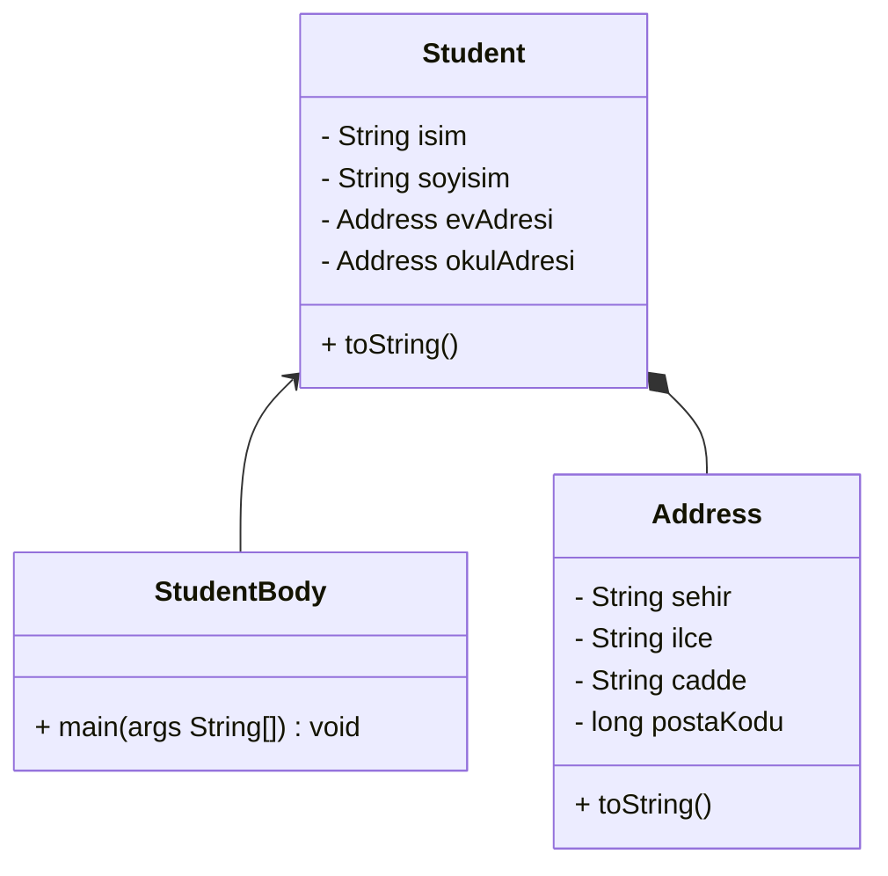

### **`this` Referansı**

- **`this`** referansı bir nesnenin kendisine referans vermesini sağlar.
- Yani, bir metodun içinde kullanılan **`this`** referansı, metodun hangi nesne üzerinden çalıştırıldığını belirtir.
- **`this`** referansının **`testMethod()`** isimli bir metot içinde kullanıldığını ve bu metodun şu şekilde çağrıldığını varsayalım:
    
    ```java
    obj1.testMethod();
    obj2.testMethod();
    ```
    
- İlk çağrıda, **`this`** referansı **`obj1`**'i ifade eder; ikinci çağrıda ise **`obj2`**'yi ifade eder

**`this`** referansı, bir sınıfın örnek değişkenlerini aynı isimdeki metot parametrelerinden ayırt etmek için kullanılabilir. Örneğin:

```java
public Account(String name, long acctNumber, double balance)
{
  this.name = name;
  this.acctNumber = acctNumber;
  this.balance = balance;
}
```

---

---

---

# 🟡 I**nheritance (Kalıtım)**

Kalıtım, nesne yönelimli programlamanın temel bir prensibidir. Bu prensibe göre, bir sınıf, diğer bir sınıfın özelliklerini ve davranışlarını miras alabilir. Bu durum, yazılım geliştirme sürecinde kodun yeniden kullanılabilirliğini artırır ve programların daha düzenli ve anlaşılır olmasını sağlar.

<aside>
💡 Ancak gereksiz yerlerde kullanılması performansı olumsuz etkiler.

</aside>

### Temel Kavramları

- **Kalıtım**, bir yazılım geliştiricisinin mevcut bir sınıftan yeni bir sınıf türetmesine olanak tanır.
- Mevcut sınıfa **ebeveyn sınıf**, **üst sınıf** veya **temel sınıf** denir.
- Türetilmiş sınıfa ise **çocuk sınıf** veya **alt sınıf** denir.
- Yani, **çocuk sınıf**, **ebeveyn sınıf** tarafından tanımlanan metotları ve verileri miras alır.

Örnek olarak, "**Hayvan**" sınıfından türetilmiş olan "**Kedi**" ve "**Köpek**" sınıflarını düşünelim. Bu durumda, "**Kedi**" ve "**Köpek**" sınıfları, "**Hayvan**" sınıfının sahip olduğu özelliklere ve davranışlara sahip olacaktır. Ancak, aynı zamanda, bu sınıflar kendi özel davranışlarını da tanımlayabilirler.

<aside>
💡 Kalıtım, kod tekrarını azaltır ve programların bakımını kolaylaştırır. Ayrıca, sınıf hiyerarşileri oluşturarak kodun daha modüler ve genişletilebilir olmasını sağlar.

</aside>

## 🕯️Bilgi Köşesi

Üç farklı sınıfımız olsun: **`Geliştirici`**, **`Muhasebeci`** ve **`Tedarikçi`**. Her bir sınıf, kendi özelliklerine sahip.

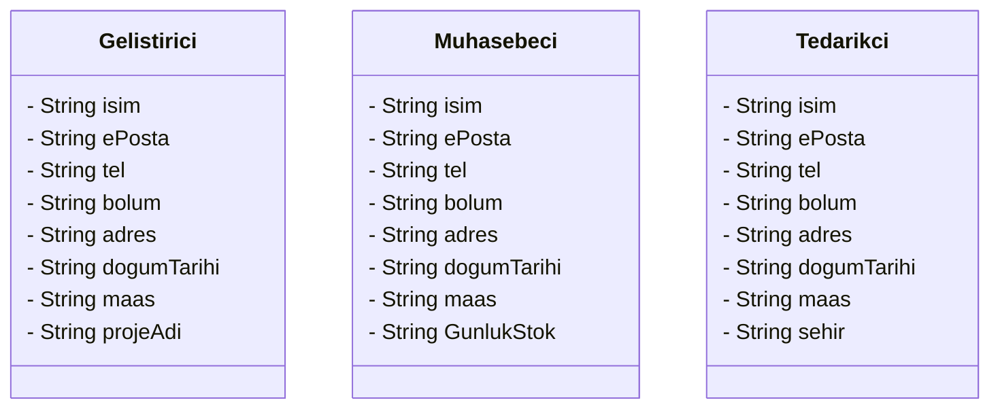

Fark edersek bu üç sınıf arasında 7 özellik **`ortaktır`**. Genelde bu kadar az olmaz, onlarca aynı özelliklere sahip bir sürü sınıfımız olur. İşte onları her bir sınıf için yazmak yerine **`genel bir sınıf içinde yazabiliriz`**. ve bu özelliklere ihtiyaç duyan her sınıf bu sınıftan miras alabilir.

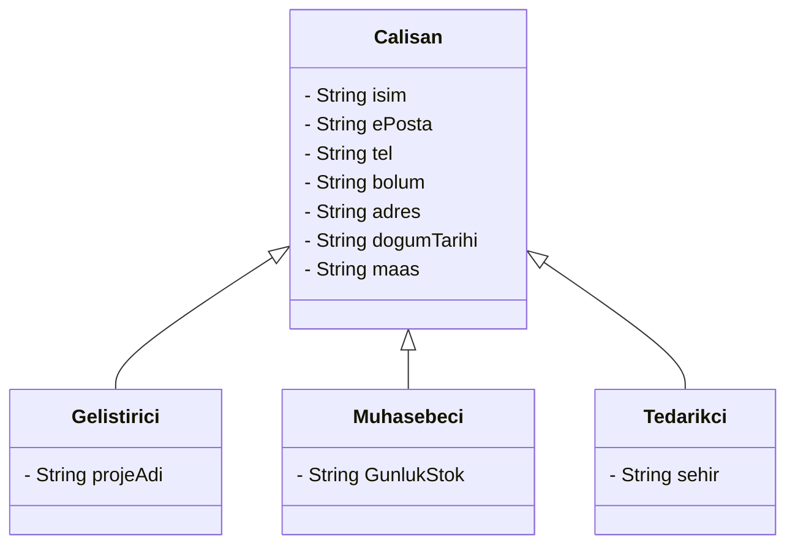

İşte böyle yaparak **`OOP`** özelliklerinden biri olan **`Reusability (Yeniden kullanılabilirlik)`** özelliğini kullanmış olduk.

<aside>
💡 Bir sınıf başka bir sınıftan miras alırsa **değişkenleri**, **metotları** ve **iç içe sınıfları(nested classes)** miras olarak almış olur.

</aside>

<aside>
💡 Her bir sınıfa ait ayrı bir **constructor**’ı olduğunu biliyoruz ancak bir sınıf başka bir sınıftan miras alırsa ebeveynin **constructor**’ı miras **`alınmaz`** ancak **`çağırılabilir`**.

</aside>

### Kalıtım Türleri

**`Single Inheritance`**

**Kendi özelliklerine ve kalıtım aldığı sınıfın özelliklerine sahip olur.**

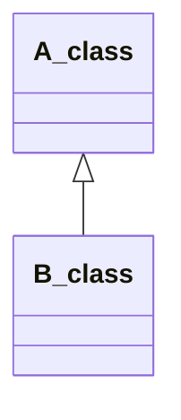

**`Multilevel Inheritance`** 

**Kendi özelliklerine ve kalıtım aldığı sınıfın özelliklerine sahip olur. Ayrıca kalıtım aldığı sınıf başka bir sınıftan kalıtım aldığı sınıfın özelliklerine de sahip olur.**

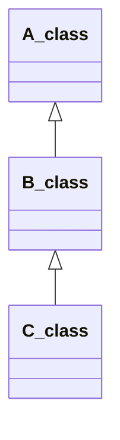

**`Hierarchical Inheritance`** 

**Birden fazla sınıf aynı sınıftan kalıtım aldığı durum.**

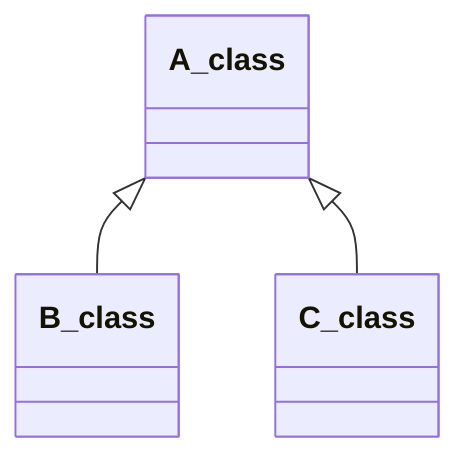

Ayrıca **`Multiple Inheritance`** türü var. Ancak **`Java`**onu doğrudan desteklemez, [**`interfaces`**](https://www.notion.so/Java-Programlama-21b3cd87c17c4fe5b29082cd7d32eb68?pvs=21) kullanarak güvenli bir şekilde sağlanabilir.

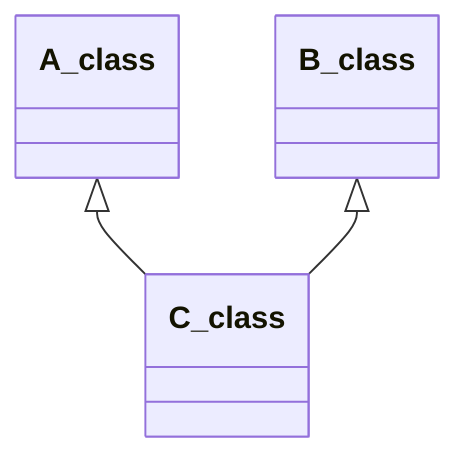

<aside>
💡 Java dili **`Multiple Inheritance`** desteklememesinin sebeplerinden biri aynı özellik hem A_class sınıfında hem de B_class mevcut ise işlem karmaşıklığı oluşmasıdır.

</aside>

<aside>
💡 Ebeveyn sınıfındaki `private` özellikler, kalıtım yoluyla alt sınıflara `aktarılmaz`. Bu özelliklere erişmek için `setter` ve `getter` metotlarının kullanılması gerekmektedir.

</aside>

### **Protected** Erişim Belirleyicisi

Bir sınıf içerisindeki `değişkenlere` ve `metotlara` dış alt sınıflardan erişebilmesini ama başka paketlerin erişmesini engellemek amacıyla kullanılan bir erişim belirleyicisi.

- **Protected Değişkenler ve Metotlar**:
    - Bir sınıf üyesi (değişken veya metot) **`protected`** olarak işaretlendiğinde, bu üye aynı sınıfın üyeleri, alt sınıfları ve aynı paketteki diğer sınıflar tarafından erişilebilir.
    - Ancak bu üye, `paket dışındaki` herhangi bir sınıf tarafından `erişilemez`.
- **Kullanım Alanları**:
    - Alt sınıfların üst sınıfın özelliklerine erişmesini sağlar.
    - Kalıtım durumlarında yardımcı olur.
    - Aynı paketteki farklı sınıflar arasında paylaşım yapılmasına olanak tanır.

### UML diyagramlarında Erişim Belirleyici Gösterimi:

<aside>
💡 **`Priavte`** değişkenler ve metotlar, başlarında `-` (eksi) simgesi ile gösterilirler.

</aside>

<aside>
💡 **`Protected**` değişkenler ve metotlar, başlarında **`#`** (kare) simgesi ile gösterilirler.

</aside>

<aside>
💡 **`Public`** değişkenler ve metotlar, başlarında `+` (artı) simgesi ile gösterilir.

</aside>

<aside>
💡 **`Default(package-private)`** değişkenler ve metotlar, başlarında `~` (Yaklaşık) simgesi ile gösterilir.

</aside>

### Erişim Belirleyicisi

| Erişim Belirleyicisi | Aynı Sınıf İçinde | Aynı Paket İçinde | Paket Dışı Ama Alt Sınıf | Paket Dışı |
| --- | --- | --- | --- | --- |
| Priavte |            ✅   |            ❌ |                ❌ |           ❌ |
| Default(package-private) |            ✅   |            ✅   |                ❌ |           ❌ |
| Protected  |            ✅   |            ✅   |                ✅    |           ❌ |
| Public |            ✅   |            ✅   |                ✅   |           ✅   |

## 🕎 Subclasses (Alt Sınıflar)

**Kalıtım İlişkileri**: UML sınıf diyagramlarında kalıtım ilişkileri, **ebeveyn sınıfa işaret eden, dolu olmayan üçgen uçlu bir ok** ile gösterilir

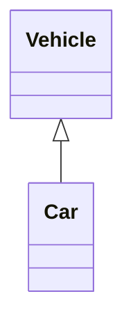

**Doğru Kalıtım**: Doğru kalıtım, bir **is-a (bir tür)** ilişki yaratır. Bu, çocuk sınıfın, ebeveyn sınıfın daha spesifik bir versiyonu olduğu anlamına gelir. Örneğin, "**Car**" (**Araba**), "**Vehicle**" (**Araç**) sınıfının daha spesifik bir türüdür

<aside>
💡 Car is Vehicle : Araba bir araçtır

</aside>

### Kullanım Şekli

Java'da bir sınıfı başka bir sınıftan türetmek için **`extends`** anahtar kelimesi kullanılır. Bu, yeni sınıfın mevcut bir sınıfın özelliklerini ve yöntemlerini miras almasını sağlar.

```java
public class Araba extends Arac {
    // Sınıf içeriği
}
```

### Örnek

Kelime diye bir sınıfın diyagramı bu şekilde olsun:

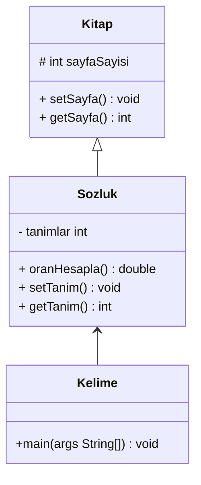

**Kitap Sınıfı:**

```java
class Kitap {
	protected int sayfaSayisi = 1500;

	// ---------------------------------------------------------------
	// Sayfa sayisi mutator.
	// ---------------------------------------------------------------
	public void setSayfa(int numSayfa) {
		sayfaSayisi = numSayfa;
	}

	// ---------------------------------------------------------------
	// Sayfa sayisi accessor.
	// ---------------------------------------------------------------
	public int getSayfa() {
		return sayfaSayisi;
	}
}
```

**Sözlük Sınıfı:**

```java

class Sozluk extends Kitap {
	private int tanimlar = 52500;

	// ----------------------------------------------------------------
	// Hem yerel hem de kalıtılan değerleri kullanarak bir mesaj yazdırır.
	// ----------------------------------------------------------------
	public double oranHesapla() {
		return (double) tanimlar / sayfaSayisi;
	}

	// ---------------------------------------------------------------
	// Tanimlar mutator.
	// ---------------------------------------------------------------
	public void setTanim(int numTanimlar) {
		tanimlar = numTanimlar;
	}

	// ---------------------------------------------------------------
	// Tanimlar accessor.
	// ---------------------------------------------------------------
	public int getTanim() {
		return tanimlar;
	}
}
```

**Kelime Sınıfı:**

```java
public class Kelime {

	public static void main(String[] args) {
		Sozluk webster = new Sozluk();
		System.out.println("Sayfa sayisi: " + webster.getSayfa());
		System.out.println("Tanim sayisi: " + webster.getTanim());
		System.out.println("Sayfa basina tanim sayisi: " + webster.oranHesapla());
	}
}
```

**Çıktısı:**

```java
Sayfa sayisi: 1500
Tanim sayisi: 52500
Sayfa basina tanim sayisi: 35.0
```

### Super() Metodu

Bir alt-sınıf, `super()` metodunu kullanarak, üst sınıfının bir nesnesini yaratabilir ve onun değişkenlerine değer atayabilir. `Sozluk` sınıfında `Kelime` sınıfına ait anlık değişkenleri kullanarak nesne yarattık. Üst-sınıfın iç-değişkenleri `private` olmadığı sürece, bunu yapmak mümkündür. Ama, üst-sınıfın değişkenleri `private` damgalı olduğunda, alt-sınıftaki kodlar, onlara erişemeyecektir. Çoğunlukla, üst-sınıfın öğelerinin `private` olmasını isteriz. Böylece üst-sınıfın yapısını diğer sınıflardan saklarız. Buna `encapsulation` denir. Bu durumlarda, üst-sınıfın öğelerine erişmenin yolu `super()` metodunu kullanmaktır.

Eğer `Kitap` sınıfına **`constructor`** metodunu eklersek ve içinde sayfa sayısı bilgisini alırsak:

```java
public Kitap(int sayfaSayisi) {
	this.sayfaSayisi = sayfaSayisi;
}
```

**`Sozluk`** sınıfında hata oluşacaktır, çünkü kendisinden bir nesne üretmek için sayfa sayısı bilgisi zorunlu olmuştur. Bu nedenle **`Sozluk`** sınıfı için de bir **`constructor`** tanımlamamız lazım. Ve içinde sayfa sayısı bilgisini almamız gerek, ardından **`super()`** metoduna parametre olarak geçirmemiz gerek.

```java
	public Sozluk(int sayfaSayisi, int tanimlar) {
		super(sayfaSayisi);
		this.tanimlar = tanimlar;
	}
```

Ve **`Sozluk`** sınıfı için bir **`constructor`** tanımladığımız için, **`Sozluk`**’tan bir nesne türettiğimizde zorunlu olarak hem sayfa sayısı hem tanımlar bilgisini girmemiz şart olmuştur.

```java
	Sozluk webster = new Sozluk(1500, 52500);
```

**Kitap Sınıfı:**

```java
class Kitap {
	protected int sayfaSayisi;
	
	public Kitap(int sayfaSayisi) {
		this.sayfaSayisi = sayfaSayisi;
	}

	public void setSayfa(int numSayfa) {
		sayfaSayisi = numSayfa;
	}

	public int getSayfa() {
		return sayfaSayisi;
	}
}
```

**Sözlük Sınıfı:**

```java
class Sozluk extends Kitap {
	private int tanimlar;

	public Sozluk(int sayfaSayisi, int tanimlar) {
		super(sayfaSayisi);
		this.tanimlar = tanimlar;
	}

	public double oranHesapla() {
		return (double) tanimlar / sayfaSayisi;
	}

	public void setTanim(int numTanimlar) {
		tanimlar = numTanimlar;
	}

	public int getTanim() {
		return tanimlar;
	}
}
```

**Kelime Sınıfı:**

```java
public class temp {

	public static void main(String[] args) {
		Sozluk webster = new Sozluk(1500, 52500);
		System.out.println("Sayfa sayisi: " + webster.getSayfa());
		System.out.println("Tanim sayisi: " + webster.getTanim());
		System.out.println("Sayfa basina tanim sayisi: " + webster.oranHesapla());
	}
}
```

**Çıktısı:**

```java
Sayfa sayisi: 1500
Tanim sayisi: 52500
Sayfa basina tanim sayisi: 35.0
```

## 🕯️Bilgi Köşesi

**`Constructor`** çalışma mekanizmasını anlamak için **`MobileGeliştirici`**, **`Geliştirici`** ve **`Calisan`**  sınıfları ele alalım ve hiç bir özellik tanımlamadan **`constructor`** üzerinde duralım. Bu üç sınıf **`Multilevel Inheritance`** olarak kalıtım almış.

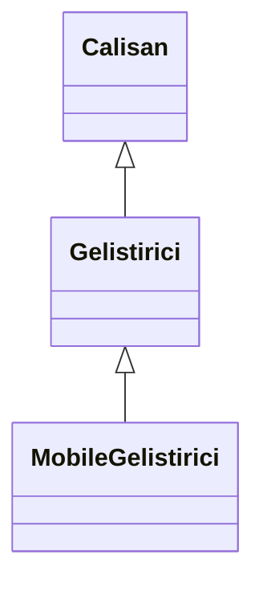

Her sınıf içinde sadece **`constructor`** tanımlayalım.

### Calisan Sınıfı:

```java
class Calisan{
	public Calisan() {
		System.out.println("Çalışan Sınıfındaki Constructorda Parametre Yoktur!");
	}
}
```

### Gelistirici Sınıfı:

```java
class Gelistirici extends Calisan{
	public Gelistirici() {
		System.out.println("Geliştirici Sınıfındaki Constructorda Parametre Yoktur!");
	}
}
```

### MobileGelistirici Sınıfı:

```java
class MobileGelistirici extends Gelistirici{
	public MobileGelistirici() {
		System.out.println("MobileGeliştirici Sınıfındaki Constructorda Parametre Yoktur!");
	}
}
```

### Main Metodu:

```java
	public static void main(String[] args) {
		MobileGelistirici mobileGelistirici = new MobileGelistirici();
	}
```

### Çıktı:

```java
Çalışan Sınıfındaki Constructorda Parametre Yoktur!
Geliştirici Sınıfındaki Constructorda Parametre Yoktur!
MobileGeliştirici Sınıfındaki Constructorda Parametre Yoktur!
```

**`MobileGelistirici`** sınıfından bir nesne türettiğimizde, yalnızca **`MobileGelistirici`**sınıfındaki **`constructor`**'ın çalışmasını bekleriz. Ancak, **`MobileGelistirici`**sınıfı **`Geliştirici`** sınıfından, **`Geliştirici`** sınıfı da **`Calisan`** sınıfından kalıtım aldığı için, tüm üst sınıf **`constructor`**'ları da çağrılacaktır. 

Peki sınıfları başka bir şekilde yazalım, bir sınıfta birden fazla **`constructor`**tanımlayalım:

### Calisan Sınıfı:

```java
class Calisan {
	protected String isim;

	public Calisan() {
		System.out.println("Çalışan Sınıfındaki Constructor Çalıştı!");
	}

	public Calisan(String isim) {
		this.isim = isim;
	}
}
```

### Gelistirici Sınıfı:

```java
class Gelistirici extends Calisan {
	public Gelistirici() {
		System.out.println("Geliştirici Sınıfındaki Constructor Çalıştı!");
	}
	
	public Gelistirici(String isim) {
		this.isim = isim;
	}
}
```

### Main Metodu:

```java
	public static void main(String[] args) {
		Gelistirici gelistirici = new Gelistirici("Yasir");
	}
```

### Çıktı:

```java
Çalışan Sınıfındaki Constructorda Parametre Yoktur!
```

Bu sefer **`Geliştirici`** sınıfından bir nesne türettik ve parametre olarak “Yasir” ismini geçirdik, **`Geliştirici`** sınıfındaki **`constructor`** parametre aldığı için ilk tanımladığımız**`constructor`** çalışmadı. Ancak fark edersek **`this.isim = isim;`** satırını iki defa yazdık, hem üst sınıfında hem de alt sınıfında, bir sınıfa onlarca parametre geçirileceğini düşünün, bu çok büyük performans kaybına sebep olur.

Bu yüzden **`super()`** metodunu kullanarak aldığımız parametreyi üst sınıfına taşıyabiliriz.

### Calisan Sınıfı:

```java
class Calisan {
	private String isim;

	public Calisan() {
		System.out.println("Çalışan Sınıfındaki Constructor Çalıştı!");
	}

	public Calisan(String isim) {
		this.isim = isim;
	}
}
```

### Gelistirici Sınıfı:

```java
class Gelistirici extends Calisan {
	public Gelistirici() {
		System.out.println("Geliştirici Sınıfındaki Constructor Çalıştı!");
	}
	
	public Gelistirici(String isim) {
		super(isim);
	}
}
```

### Main Metodu:

```java
	public static void main(String[] args) {
		Gelistirici gelistirici = new Gelistirici("Yasir");
	}
```

### Çıktı:

```java

```

# 🟡 **Polymorphism (Çok Biçimlilik)**

Polymorphism, nesne yönelimli programlamada, aynı işlemin farklı nesneler üzerinde farklı şekillerde gerçekleştirilebilmesini sağlayan bir kavramdır. 

## **Avantajları**

- **Esneklik:** Kodunuzu daha esnek ve genişletilebilir hale getirir.
- **Bakım Kolaylığı:** Farklı sınıflarda aynı metodu kullanarak kodun bakımını kolaylaştırır.
- **Kod Tekrarını Azaltma:** Ortak bir arayüz veya üst sınıf kullanarak kod tekrarını azaltır.

## Türleri

- **Metot Overloading:** Aynı sınıf içinde, aynı isimde fakat farklı parametre listelerine sahip metotların tanımlanması.

- **Metot Overriding:** Bir alt sınıfın, üst sınıfından miras aldığı bir metodu yeniden tanımlayarak, ihtiyaçlarına göre uyarlaması

### Overloading (Aşırı Yükleme)

Aynı sınıf içinde aynı isimde fakat farklı parametre listelerine sahip metotlar tanımlanabilir. Bu metotlar aynı ismi taşısa da, farklı parametreler ile çağrıldıklarında farklı işlevler gerçekleştirirler.

**ÖRNEK:**

```java
class Restoran {
	public float siparis1(float toplamFiyat) {
		return toplamFiyat;
	}

	public float siparis2(float toplamFiyat, float kargoUcreti) {
		return toplamFiyat + kargoUcreti;
	}

	public float siparis3(float toplamFiyat, float kargoUcreti, String kupon) {
		float oran = getOranByKupon(kupon);
		float indirim = toplamFiyat * oran;
		return toplamFiyat + kargoUcreti - indirim;
	}

	private float getOranByKupon(String kupon) {
		return 0.6f; // Bu metotta veritabanına bağlanıp bu kupon için uygulanacak indirim
						// oranını belirlediğimizi düşünelim
	}
}
```

Yukarıdaki kodda, `siparis1()` metodu restoran içinden bir siparişin verildiği durumu, siparis2() metodu restoran dışından bir siparişin verildiği durumu, ve `siparis3()` metodu ise restoran dışından birinin indirim kuponu kullanarak sipariş verdiği durumu ifade etmektedir.

Ancak bu 3 metodu tanımlamak yerine **`Polymorphism`** kavramından ****yararlanarak tek bir isim altında `siparis()` olarak tanımlayarak, gönderilen parametrelere göre hangi durum olduğunu tespit edilir ve ona göre işlem yapılır.

```java
public class Ornek {

	public static void main(String[] args) {
		Restoran restoran = new Restoran();
		System.out.println(restoran.siparis(100)); // 100
		System.out.println(restoran.siparis(100, 50)); // 100 + 50 = 150
		System.out.println(restoran.siparis(100, 50, "Free Palestine")); 
							  // 100 + 50 - (100 - (100 * 0.6)) = 100 + 50 - 60 = 90
	}

}

class Restoran {
	public float siparis(float toplamFiyat) {
		return toplamFiyat;
	}

	public float siparis(float toplamFiyat, float kargoUcreti) {
		return toplamFiyat + kargoUcreti;
	}

	public float siparis(float toplamFiyat, float kargoUcreti, String kupon) {
		float oran = getOranByKupon(kupon);
		float indirim = toplamFiyat * oran;
		return toplamFiyat + kargoUcreti - indirim;
	}

	private float getOranByKupon(String kupon) {
		return 0.6f; // Bu metotta veritabanına bağlanıp bu kupon için uygulanacak indirim
						// oranını belirlediğimizi düşünelim
	}
}
```

**Başka bir örnek:**

```java
public class Banka {

    // Müşteri ismi alan yazdir metodu
    public void yazdir(String isim) {
        System.out.println("Müşteri İsmi: " + isim);
    }

    // Müşteri ID'si alan yazdir metodu
    public void yazdir(int id) {
        System.out.println("Müşteri ID: " + id);
    }

    // Hem müşteri ismi hem de ID'si alan yazdir metodu
    public void yazdir(String isim, int id) {
        System.out.println("Müşteri İsmi: " + isim + ", Müşteri ID: " + id);
    }

    public static void main(String[] args) {
        Banka banka = new Banka();

        // Farklı yazdir metodları çağrılıyor
        banka.yazdir("Ali"); // Müşteri İsmi: Ali
        banka.yazdir(12345); // Müşteri ID: 12345
        banka.yazdir("Ayşe", 67890); // Müşteri İsmi: Ayşe, Müşteri ID: 67890
    }
}

```

Bu örnekte, `yazdir()` metodunu çağırdığımızda bizden bir parametre girmemiz istenir. Bu parametre hem `String` hem de `int` olabilir. Eğer bir `String` girdiğimizde, metot otomatik olarak bunun bir müşteri ismi olduğunu anlayıp, müşteri ismini yazdıracaktır. Eğer bir `int` parametre gönderirsek, bu durumda metot bunun bir müşteri ID'si olduğunu anlayıp, müşteri ID'sini yazdıracaktır. Eğer iki parametre, yani bir `String` ve bir `int` girersek, her ikisini de yazdıracaktır.

<aside>
💡 Bu işlem, `System.out.println()` metodunu hatırlatıyor. Bu metot, bir dize `String`, tamsayı `integer` veya ondalık sayı `double` gibi çeşitli veri türlerini kabul eder ve bunları ekrana yazdırır.

</aside>

### Overriding (Geçersiz Kılma)

Alt sınıflar, üst sınıflarından `miras aldıkları` metotları kendi ihtiyaçlarına göre yeniden tanımlayabilirler. Bu sayede, aynı isimdeki metotlar farklı sınıflarda farklı işlevsellikler sağlayabilir.

**ÖRNEK:**

Çalışanların maaşlarını yönetmek için bir sistem düşünelim, üst sınıf olarak **`Employee`** sınıfı olsun. Çalışanların türleri var **`Salaried Employee (Aylık Çalışan)`**, **`Daily Employee (Günlük Çalışan)`** ve **`Hourly Employee (Saatlik Çalışan)`** . Her biri üst sınıfından miras alıyor. işte her birinin de maaşı ayrı hesaplanması gerek çünkü bazıları bounsları var veya bazıları saat bazında maaşı hesaplanır. Bu yüzden sınıftan sınıfa **`getSalary()`** metodu değişmelidir.

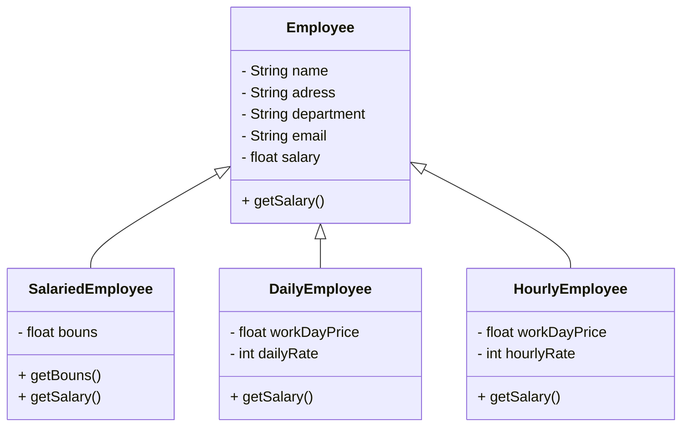

 **Employee sınıfı:** 

```java
class Employee {
	private String name, department;
	private float salary;

	public Employee(String name, String department, float salary) {
		this.name = name;
		this.department = department;
		this.salary = salary;
	}

	public float getSalary() {
		return salary;
	}
}
```

 **SalariedEmployee sınıfı:** 

```java
class SalariedEmployee extends Employee {
	private float bouns;

	public SalariedEmployee(float bouns, String name, String department, float salary) {
		super(name, department, salary);
		this.bouns = bouns;
	}
	
	public float getBouns() {
		return bouns;
	}
}
```

 **DailyEmployee sınıfı:** 

```java
class DailyEmployee extends Employee {
	private float workDayPrice;
	private int dailyRate;

	public DailyEmployee(float workDayPrice, int dailyRate, String name, String department, float salary) {
		super(name, department, salary);
		this.workDayPrice = workDayPrice;
		this.dailyRate = dailyRate;

}
```

 **HourlyEmployee sınıfı:** 

```java
class HourlyEmployee extends Employee {
	private float workDayPrice;
	private int hourlyRate;

	public HourlyEmployee(float workDayPrice, int hourlyRate, String name, String department, float salary) {
		super(name, department, salary);
		this.workDayPrice = workDayPrice;
		this.hourlyRate = hourlyRate;
	
}
```

<aside>
📢 Her bir sınıf için `Getter` ve `Setter` metotlarını tanımlamayı unutmayalım, burada kod kalabalığı olmasın diye tanımlamadım.

</aside>

Sınıfları tamamladıktan sonra **`Main`** metoduna **`Employee`** ve **`SalariedEmployee`** sınıflardan bir nesne oluşturup maaşlarını yazdıralım:
 **Main Metodu:** 

```java
public static void main(String[] args) {
	Employee e1 = new Employee("Yasir", "Siber Güvenlik Uzmanı", 900000);
	System.out.println("Yasir Salary: " + e1.getSalary()); // salary

	SalariedEmployee e2 = new SalariedEmployee(200, "Vasim", "Yapay Zeka Uzmanı", 900000);
	System.out.println("Vasim Salary: " + e2.getSalary()); // salary + bouns
}
```

 **Çıktı:** 

```java
Yasir Salary: 900000.0
Vasim Salary: 900000.0
```

İki maaş aynı olduğunu görüyoruz ancak **`Vasim’in`** 200 bounsı eklenmesi gerekiyordu. Bu yüzden **`SalariedEmployee`** sınıfı için `getSalary()` metodu farklı işlemler yapması gerek, sadece maaş döndürmeyecek bounsı da ekleyecektir. Yani **`SalariedEmployee`** sınıfından bir nesne türetildiğinde ve `getSalary()` metodu çağırdığımda **`Employee`** sınıfına ait metot değil, **`SalariedEmployee`** sınıfına metot çağırılması gerek.

 **SalariedEmployee sınıfı içinde getSalary() yazılması:** 

```java
class SalariedEmployee extends Employee {
	private float bouns;

	public SalariedEmployee(float bouns, String name, String department, float salary) {
		super(name, department, salary);
		this.bouns = bouns;
	}
	
	public float getBouns() {
		return bouns;
	}

	@Override
	public float getSalary() {
		return super.getSalary() + bouns;
	}
}
```

Böylece Maindeki aynı kodu çalıştırdığımızda **`maaş + bouns`** toplayarak döndürecektir.

 **Çıktı:** 

```java
Yasir Salary: 900000.0
Vasim Salary: 900200.0
```

<aside>
💡 `@Override` ifadesi, bir metodun ezildiğini belirtir. Bu ifade, derleyicinin metot imzasını kontrol etmesini sağlar ve ezme işleminin doğru yapıldığını garanti eder. Yazmazsak çalışır mı ? **`Evet`** çalışır

</aside>

<aside>
💡 Eğer üst sınıfta `getSalary()` metodu yoksa ve alt sınıfında `getSalary()` metodu tanımlayıp üstüne`@Override` ifadesini yazarsak üst sınıfındaki ezilecek metodu bulamadığı için `compiler` hata verecektir.

</aside>

Aynı şekilde kalan sınıflar için maaş hesaplama metodu farklı yazılacaktır:

 **DailyEmployee sınıfı içinde getSalary() yazılması:** 

```java
class DailyEmployee extends Employee {
	private float workDayPrice;
	private int dailyRate;

	public DailyEmployee(float workDayPrice, int dailyRate, String name, String department, float salary) {
		super(name, department, salary);
		this.workDayPrice = workDayPrice;
		this.dailyRate = dailyRate;
	}
	
	@Override
	public float getSalary() {
		return workDayPrice * dailyRate;
	}
}
```

 **HourlyEmployee sınıfı içinde getSalary() yazılması:** 

```java
class HourlyEmployee extends Employee {
	private float workDayPrice;
	private int hourlyRate;

	public HourlyEmployee(float workDayPrice, int hourlyRate, String name, String department, float salary) {
		super(name, department, salary);
		this.workDayPrice = workDayPrice;
		this.hourlyRate = hourlyRate;
	}
	
	@Override
	public float getSalary() {
		return workDayPrice * hourlyRate;
	}	
}
```

<aside>
💡 upcasting alt sınıftan oluşturulmuş bir nesneyi üst sınıftan oluşturulmuş bir nesneye çevirmek

</aside>

Yani **`upcasting`** özelliğini kullanarak biz sadece **`Employee`** sınıfından bir nesne türetebiliriz ardından birden fazla alt sınıflarından atama yapabiliriz `overloading` yaparak yeni bir değer alabiliyor.

```java
	public static void main(String[] args) {
		Employee e1;
		
		e1 =new Employee("Yasir", "Siber Güvenlik Uzmanı", 900000);
		System.out.println("Yasir Salary: " + e1.getSalary()); // salary

		e1 = new SalariedEmployee(200, "Vasim", "Yapay Zeka Uzmanı", 900000);
		System.out.println("Vasim Salary: " + e1.getSalary()); // salary + bouns

		e1 = new DailyEmployee(30, 29000, "Elif", "Görüntü İşleme Uzmanı", 0);
		System.out.println("Elif  Salary: " + e1.getSalary()); // workDayPrice * dailyRate

		e1 = new HourlyEmployee(250,3300, "Motaz", "Derin Öğrenme Uzmanı", 0);
		System.out.println("Motaz Salary: " + e1.getSalary()); // workDayPrice * hourlyRate
	}
```

```java
Yasir Salary: 900000.0
Vasim Salary: 900200.0
Elif  Salary: 870000.0
Motaz Salary: 825000.0
```

Ancak upcasting özelliğini kullanarak her zaman aynı işlemleri yapamayız

```java
	public static void main(String[] args) {
		Employee e1 = new Employee("Yasir", "Siber Güvenlik Uzmanı", 900000);
		System.out.println("Yasir Salary: " + e1.getSalary()); // salary

		Employee e2 = new SalariedEmployee(200, "Vasim", "Yapay Zeka Uzmanı", 900000);
		System.out.println("Vasim Bouns: " + e2.**getBouns**()); // Hata Verecek
	}
```

Üst sınıftan bir nesne tanımlayıp alt sınıflardan türettiğimizde alt sınıfta bulunup üst sınıfta bulunmayan private metotlara erişemeyiz. Fakat `override` yapılmışsa alt sınıfın metodunu çalıştırır.

Alt sınıflara ait metotları kullanmak için referansı uygun şekilde dönüştürülmesi gerek.

<aside>
💡 **cast() yöntemi,** bir veri türünü başka bir veri türüne dönüştürmek için kullanılır.

</aside>

Komutu bu şekilde güncellememiz gerek:

```java
e2.getBouns()   =>  (SalariedEmployee)e2).getBouns()
```

Main Metodunda Yazalım:

```java
public static void main(String[] args) {
	Employee e1 = new Employee("Yasir", "Siber Güvenlik Uzmanı", 900000);
	System.out.println("Yasir Salary: " + e1.getSalary()); // Yasir Salary: 900000

	Employee e2 = new SalariedEmployee(200, "Vasim", "Yapay Zeka Uzmanı", 900000);
	System.out.println("Vasim Bouns: " + ((SalariedEmployee)e2).getBouns()); // Vasim Bouns: 200
}
```

<aside>
⭐  Önemli Bilgi: upcasting durumlarda `static` metotlara override yapılmaz

</aside>

# `❤️‍🔥  Aggregation  ❤️‍🔥`

- Alt nesne bağımsız bir yaşam döngüsüne sahiptir.
- Has-A ilişkisi.
- Zayıf sahiplik (weak ownership). Alt nesne, üst nesneden bağımsız olarak var olabilir.
- UML diyagramlarında, boş bir elmas sembolü ile temsil edilir.

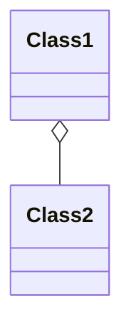

# `❤️‍🔥  Composition  ❤️‍🔥`

- Alt nesne üst nesne ile aynı yaşam döngüsüne sahiptir.
- Part-Of ilişkisi.
- Güçlü sahiplik (strong ownership). Alt nesne, üst nesne olmadan var olamaz.
- UML diyagramlarında, dolu bir elmas sembolü ile temsil edilir.

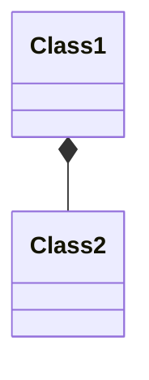

## Örnek:

Bu UML diyagramını kodlayın

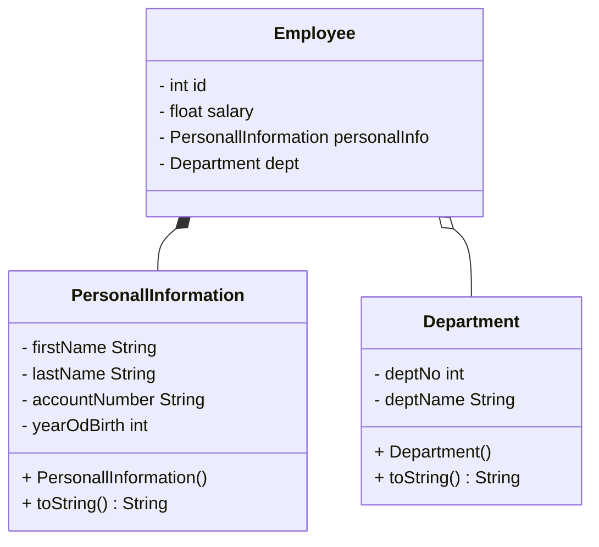

Bu UML diyagramında kalıtım yoktur, ancak `PersonalInformation` sınıfı `Employee` sınıfı için vazgeçilmezdir, `olmazsa olmazdır`. Sonuçta, bir çalışan isimsiz olamaz, değil mi? İşte bu tür ilişkiye `part-of` denir. Bir diğer yandan, `Department` sınıfı için bir çalışan **null atama** yaparak hiç departmana sahip olmayabilir, bir departmana sahip olabilir veya **ArrayList** kullanarak birden fazla departmana dahil edebiliriz. Bu ilişkiye ise `has-a` denir.

### Employee Sınıfı:

```java
class Employee {
	private int id;
	private float salary;
	private PersonalInformation personalInfo; // Composition Relationship
	private Department dept; // Aggregation Relationship

	public Employee(int id, float salary, String firstName, String lastName, String accountNumber, int yearOfBirth,
			Department dept) {
		this.id = id;
		this.salary = salary;
		this.personalInfo = new PersonalInformation(firstName, lastName, accountNumber, yearOfBirth);
		this.dept = dept;
	}

	@Override
	public String toString() {
		return "Employee [id=" + id + ", salary=" + salary + ", personalInfo=" + personalInfo + ", dept=" + dept + "]";
	}
}
```

### PersonalInformation Sınıfı:

```java
class PersonalInformation {
	private String firstName, lastName, accountNumber;
	private int yearOfBirth;

	public PersonalInformation(String firstName, String lastName, String accountNumber, int yearOfBirth) {
		super();
		this.firstName = firstName;
		this.lastName = lastName;
		this.accountNumber = accountNumber;
		this.yearOfBirth = yearOfBirth;
	}

	@Override
	public String toString() {
		return "PersonalInformation [firstName=" + firstName + ", lastName=" + lastName + ", accountNumber="
				+ accountNumber + ", yearOfBirth=" + yearOfBirth + "]";
	}
}
```

### Department Sınıfı:

```java
class Department {
	private int deptNo;
	private String deptName;

	public Department(int deptNo, String deptName) {
		super();
		this.deptNo = deptNo;
		this.deptName = deptName;
	}

	@Override
	public String toString() {
		return "Department [deptNo=" + deptNo + ", deptName=" + deptName + "]";
	}
}
```

### Main Metodu:

```java
public static void main(String[] args) {

	Department dept1 = new Department(123, "Cybersecurity");

	Employee emp1 = new Employee(1, 900000, "Yasir", "Alrawi", "00", 2001, dept1);
	Employee emp2 = new Employee(2, 900000, "Motaz", "Alrawi", "01", 2003, dept1);

	System.out.println(emp1);
	System.out.println(emp2);
}
```

### Çıktısı:

```java
Employee [id=1, salary=900000.0, personalInfo=PersonalInformation [firstName=Yasir, lastName=Alrawi, accountNumber=00, yearOfBirth=2001], dept=Department [deptNo=123, deptName=Cybersecurity]]
Employee [id=2, salary=900000.0, personalInfo=PersonalInformation [firstName=Motaz, lastName=Alrawi, accountNumber=01, yearOfBirth=2003], dept=Department [deptNo=123, deptName=Cybersecurity]]
```

<aside>
❓ **Koda dikkatlice bakın ve `PersonalInformation` sınıfını neden main metodunda doğrudan tanımlamadığımızı, aynı zamanda `Department` sınıfını neden tanımladığımızı anlamaya çalışın.**

</aside>

- ✅ **Cevap Göster**
    
    Öncelikle **`PersonalInformation`** sınıfı ile `Employee` arasındaki ilişki `Composition`  olduğunu fark etmiş olmalıyız. Bu yüzden eğer bu şekilde tanımlarsam:
    
    ```java
    PersonalInformation personalInfo = new PersonalInformation ("Yasir", "Alrawi", "00", 2001);
    Employee emp1 = new Employee(1, 900000, personalInfo, dept1);
    ```
    
    Compiler kod segmentini çalıştırdığında, `Employee` nesnesi okunduktan sonra hafızadan silinecektir. Ancak, aynı zamanda **`PersonalInformation`** nesnesinin de silinmesi gerekir. Aksi takdirde bir çalışanın kişisel bilgileri başka bir çalışan için kullanılabilir. Bu yüzden **`PersonalInformation`** nesnesi, başka bir `Employee` nesnesi için kullanılamaz. İşte bu nedenle **`PersonalInformation part of Employee`**.
    
    Ancak **`Department`** sınıfı ile `Employee` sınıfı arasındaki ilişki `Aggregation` ilişkisi olduğu için birden fazla çalışan aynı departmana sahip olabildiği için `Employee` nesnesi hafızadan silindiği zaman **`Department`** nesnesi kalabilir. ve başka çalışan için kullanılabilir. çünkü `Employee has a Department`
    

# 🟡 Abstraction

### [🟡 Abstract Class](https://www.notion.so/Java-Programlama-21b3cd87c17c4fe5b29082cd7d32eb68?pvs=21)

### [🟡 Interface](https://www.notion.so/Java-Programlama-21b3cd87c17c4fe5b29082cd7d32eb68?pvs=21)

# 🟡 **Abstract Class (Soyut Sınıf)**

Bir **`abstract`** class, bir sınıf hiyerarşisinde genel bir kavramı temsil eden yer tutucu bir sınıftır. **"abstract"** anahtar kelimesi ile tanımlanan sınıflardır. Sınıfın içinde soyut **`abstract`** metotlar veya normal fonksiyonlar tanımlanabilir. Soyut sınıflardan **"new"** anahtar kelimesi ile bir nesne oluşturulamaz.

## Özellikleri

- Bir **`abstract`** class, soyut **`abstract`** ve somut **`concrete`** metotları içerebilir.
- Bir **`abstract`** class, doğrudan örneklenemez; yani, soyut sınıflardan **'new'** anahtar kelimesi ile nesne oluşturamazsınız ve bu tür sınıflar yalnızca başka sınıflar tarafından miras alınarak kullanılabilir.
- Soyut metotlar, **`abstract`** class içinde tanımlanır, ancak **`somut`** bir implementasyonları yoktur. Bunun yerine, alt sınıflar tarafından override edilmeleri gerekir.
- **`Abstract`** class, genellikle alt sınıflar arasında ortak özellikleri paylaşmak için kullanılır.
- **`Abstract`** class'ın kendisi soyut bir sınıf olabilir, yani içinde soyut metotlar bulunan bir sınıf. Bu durumda, alt sınıflar soyut metotları uygulamak zorundadır.
- Kurucu metot **`constructor`** ve **`statik`** metotlar tanımlanabilir.
- `Final` olarak tanımlanmış metotları içerebilir, bu metotlar alt sınıflarda ezilemez (override edilemez).
- UML diyagramında **`abstract`** sınıfları göstermek için sınıfın adı **`*italik*`** olarak veya üstüne **`<<abstract>>`** yazılır.

## Söz Dizimi

```java
abstract class className{ }
```

Bir abstract class hem abstract metotlar hem de non-abstract metotlar içerebilir:

```java
public abstract class className{
	
	abstract void metot1(); // abstract metot
	
	void metot2() {} // non-abstract metot
	
}
```

## Örnek

Bir otomobil üretim firması, araçlarını yönetmesi için bir sistem kurmak istiyor:

- Tekerlek Sayısı
- Uzunluk
- Ağırlık

Ayrıca, bu araçların aşağıdaki hizmetleri sunabildiğinden emin olmalıdır:

- Otomatik Sürüş
- Akış Hizmetleri
- Park Sensörü

Bildiğimiz gibi araba türleri çoktur **Hatchback, SUV, Sedan vs..** araba türleri vardır, işte üretilen tüm türler için bu yukarıda tanımladığımız özellikler ve hizmetler olması gerek.

Bu sistemi kuran programcıların bu özellikleri ve hizmetleri dahil etmek zorunda bırakılabilmesi için abstract olarak tanımlamamız gerek.

Yani bu özellikler ve hizmetler tanımlanacağı her class içinde bulunmaları gerek.

### UML  Diyagramı

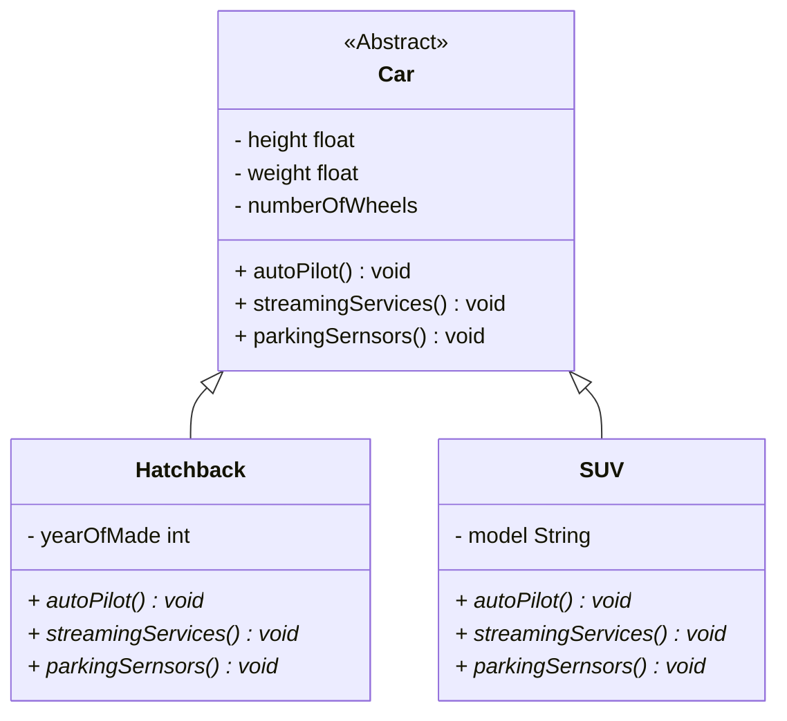

Genelde sadece 2 tür araba üzerinde örnek verelim ancak uygulayacağımız işlemler tanımlanacağı her araba türü temsil eden sınıfın içinde tanımlanması gerekecektir.

### Car Sınıfı

```java
abstract class Car {
	private float height ;
	private float weight;
	private int numberOfWheels;

	public float getHeight () {
		return height ;
	}

	public void setHeight (float height ) {
		this.height  = height ;
	}

	public float getWeight() {
		return weight;
	}

	public void setWeight(float weight) {
		this.weight = weight;
	}

	public int getNumberOfWheels() {
		return numberOfWheels;
	}

	public void setNumberOfWheels(int numberOfWheels) {
		this.numberOfWheels = numberOfWheels;
	}

	abstract void autoPilot();

	abstract void streamingServices();

	abstract void parkingSernsors();
}
```

Ebeveyn sınıfı tanımlarken, **`abstract`** anahtar kelimesini kullanarak bu sınıfı soyut hale getiriyoruz. Bu sınıf içinde istediğimiz özellikleri tanımlıyoruz. Ayrıca, soyut metotları tanımlayarak, bu metotların içerisindeki davranışları belirtiyoruz. Ancak bu metotların gerçek bir implementasyonu olmaz, sadece imza olarak bırakılır.

### Hatchback Sınıfı

```java
class Hatchback extends Car {

	private int yearOfMade;

	public Hatchback(int yearOfMade) {
		this.yearOfMade = yearOfMade;
	}

	public int getYearOfMade() {
		return yearOfMade;
	}

	public void setYearOfMade(int yearOfMade) {
		this.yearOfMade = yearOfMade;
	}

	@Override
	void autoPilot() {
		System.out.println("Hatchback autoPilot");
	}

	@Override
	void streamingServices() {
		System.out.println("Hatchback streamingServices");
	}

	@Override
	void parkingSernsors() {
		System.out.println("Hatchback parkingSernsors");
	}
}
```

**`Hatchback`** sınıfını tanımladığımızda, **`Car`** sınıfından kalıtım alacaktır. Bu durumda, **`Car`** sınıfında **`abstract`** olarak tanımlanan metotları **`Hatchback`** sınıfının içinde gerçek bir implementasyon ile tanımlamamız gerekecektir.

### SUV Sınıfı

```java
class SUV extends Car {

	private String model;

	public SUV(String model) {
		this.model = model;
	}

	public String getModel() {
		return model;
	}

	public void setModel(String model) {
		this.model = model;
	}

	@Override
	void autoPilot() {
		System.out.println("SUV autoPilot");
	}

	@Override
	void streamingServices() {
		System.out.println("SUV streamingServices");
	}

	@Override
	void parkingSernsors() {
		System.out.println("SUV parkingSernsors");
	}
}
```

Şimdi Main içinde arabaları için nesneler türeterek çıktıyı görelim:

### Main Metodu

```java
	public static void main(String[] args) {
		Hatchback car1 = new Hatchback(2024);
		SUV car2 = new SUV("Egea Cross");

		car1.autoPilot();
		car2.parkingSernsors();
	}
```

### Çıktısı

```java
Hatchback autoPilot
SUV parkingSernsors
```

Bu şekilde, **`abstract`** kullanarak **`Car`** sınıfından kalıtım alan her sınıfın istenilen özellikleri içinde tanımlaması sağlanır

## Abstract and Polymorphism

Yukarıdaki sistemi için Main sınıfında her bir araç türüne ait sınıfı için bir metot tanımlamak istiyorum. Bu metot ilgili araç türünün sınıfından bir nesne parametre olarak alacaktır.

```java
public class Main {

	static void fun1(SUV suv) {
		suv.autoPilot();
		System.out.println("Ağırlık: " + suv.getWeight());
	}

	static void fun2(Hatchback hatchback) {
		hatchback.autoPilot();
		System.out.println("Ağırlık: " + hatchback.getWeight());
	}

	public static void main(String[] args) {
		SUV suv = new SUV("Egea Cross", 5.2f, 3200, 4);
		fun1(suv);

		Hatchback hatchback = new Hatchback(4, 4.9f, 3500, 4);
		fun2(hatchback);
	}
}
```

Doğru bir şekilde çıktısını göreceğiz

```java
SUV autoPilot
Ağırlık: 3200.0
Hackback autoPilot
Ağırlık: 3500.0
```

Ancak onlarca metot yazılacak, bunun yerine tek bir metot yapabiliriz. alacağı parametre alt sınıftan bir nesne değil de ebeveyn sınıfından bir nesne olması gerek.

```java
public class Main {

	static void fun(Car car) {
		car.autoPilot();
		System.out.println("Ağırlık: " + car.getWeight());
	}

	public static void main(String[] args) {
		SUV suv = new SUV("Egea Cross", 5.2f, 3200, 4);
		fun(suv);

		Hatchback hatchback = new Hatchback(4, 4.9f, 3500, 4);
		fun(hatchback);
	}
}
```

Bu şekilde yaptığımızda aynı çıktıyı göreceğiz ancak onlarca metodu tek bir metot ile yazabildik

## 🕯️Bilgi Köşesi

Daha önce dediğimiz gibi biz genelde **`abstract`** bir sınıftan bir nesne türetemeyiz, türetmeye çalıştığımızda hata alacağız:

```java
 // HATALI KOD 
Car car = new Car(); // error "Cannot instantiate the type Car"
```

Ancak **`Car`** sınıfı içinde bir `constructor` tanımlayabiliriz, Peki madem biz ondan bir nesne türetemeyeceğiz neden tanımlamaya ihtiyaç duyuyoruz ?

Yani biz bunu yapamıyoruz değil mi ?

```java
 // HATALI KOD 
Car car = new Car("Red", 123); // error "Cannot instantiate the type Car"
```

Peki biz **`Car`** sınıfından kalıtım alan sınıflardan bir nesne ürettiğimizde, `height` bilgisini yalnızca `setHeight()` metodunu kullanarak atayabiliyorduk. Ancak, `height` bilgisinin zorunlu olarak atanmasını istiyoruz ve **`Car`** sınıfından bir nesne türetemeyeceğimize göre alt sınıflardan nesne türettiğimizde zorunlu olarak atanmasını sağlamamız gerek. Örneğin, `SUV` sınıfından bir nesne oluşturduğumuzda, `height` bilgisinin atanması zorunlu olmalıdır. Bunu sağlamak için, `height` bilgisini `SUV` sınıfının `constructor`'ında alabiliriz. **`SUV`** sınıfın içindeki `constructor`’ı bu şekilde yazabiliriz:

```java
public SUV(String model, float height, float weight, int numberOfWheels) {
	this.model = model;
	this.setHeight(height);
	this.setWeight(weight);
	this.setNumberOfWheels(numberOfWheels);
}
```

Bu şekilde **`SUV`** sınıfından bir nesne türettiğimizde **`Car`** özelliklerini zorunlu kıldık. **Bu yaklaşım doğru mu ?**

**Çalışır ancak doğru değildir.**

İşte `can alıcı` noktaya geldik, **`Car`** sınıfından nesne türetemiyoruz doğru ancak içinde bir `constructor` tanımlamaya ihtiyaç duyuyoruz. Çünkü alt sınıflarda setter metotlarını kullanmak yerinde daha performanslı olan `super()` metodunu kullanacağız.

Kalıtım alan alt sınıflardan üst-sınıf değişkenlerine atama yapmak için **`super()`** metodunu kullanıldığını öğrendik. **Göz atmak için** [**tıklayın**](notion://www.notion.so/21b3cd87c17c4fe5b29082cd7d32eb68?pvs=25#473be84366184a72934ebca2f2f1aab7)

Demek ki **`Car`** sınıfın içinde `constructor` tanımlayarak zorunlu alınması gereken özellikleri `constructor` içinde alabiliriz. ardından alt sınıflarda `super()` metodunu kullanarak kolay bir şekilde atama işlemini gerçekleştirmiş oluruz.

```java
	public Car(float height , float weight, int numberOfWheels) {
		this.height  = height ;
		this.weight = weight;
		this.numberOfWheels = numberOfWheels;
	}
```

Ardından **`SUV`** sınıfında setter metotları değil `super()` metodunu kullanarak atama yaparız.

```java
public SUV(String model, float height, float weight, int numberOfWheels) {
	super(height,weight,numberOfWheels);
	this.model = model;
}
```

İşte bu durumda **`SUV`** sınıfından bir nesne türettiğimizde bu şekilde türetmemiz gerekecektir:

```java
	SUV car2 = new SUV("Egea Cross", 5.2f, 3200, 4);
```

### ⭕ SORU: Üst sınıfın constructor parametrelerini göndermeden alt sınıflardan nesne üretmek için ne yapılır?

- ✅ **Cevap Göster**
    
    **`Car`** sınıfın içinde boş bir `constructor` ekleyerek yapılır, yani hem parametresiz hem de parametre alan `constructor` tanımlanacaktır:
    
    ```java
    public Car() {
    
    }
    
    public Car(float height, float weight, int numberOfWheels) {
    	this.height = height;
    	this.weight = weight;
    	this.numberOfWheels = numberOfWheels;
    }
    ```
    
    Böylece alt sınıflardan bir nesne türettiğimizde **`Car`** özelliklerine atamayı isteğe balı haline getirmiş olduk. 
    
    **Örneğin: `SUV`** sınıfından nesne türettiğimizde **`Car`** parametrelerini göndermek istemiyorum. Bu durumda **`SUV`** sınıfın constructor’ı bu şekilde tanımlayabiliriz:
    
    ```java
    	public SUV(String model) {
    		this.model = model;
    	}
    ```
    
    Bu durumda **`SUV`** sınıfından bir nesne türettiğimizde bu şekilde türetebileceğiz:
    
    ```java
    	SUV car2 = new SUV("Egea Cross");
    ```
    

### ⭕ SORU: Üst sınıfın constructor parametrelerinin isteğe bağlı olmasını istiyorum. Bazı nesneler oluştururken bu parametreleri göndermek istiyorum, bazılarında ise göndermemek istiyorum. Yani bu şekilde iki tanımlama nasıl yapabilirim ?

```java
	SUV car2 = new SUV("Egea Cross");
```

```java
	SUV car2 = new SUV("Egea Cross", 5.2f, 3200, 4);
```

- ✅ **Cevap Göster**
    
    ## 🛑 Dur 🛑
    Soruyu çözemeden cevaba bakacaksan, sana bir ipucu:
    
    **Polymorphism**’i hatırlıyor musun? İki türü vardı: **`Overloading`** ve **`Overriding`**. Bu soruyu çözmek için birini kullanıyorduk. Yoksa hatırlamıyor musun? Hiç problem değil, [**`tıkla`**](https://www.notion.so/Java-Programlama-21b3cd87c17c4fe5b29082cd7d32eb68?pvs=21), oku gel!
    
    - ✅ **Cevap Göster**
        
        Önceki soruda açıklandığı gibi, üst sınıfta parametresiz bir `constructor` tanımlanmalıdır. Ardından, alt sınıfta hem parametresiz hem de üst sınıfın parametrelerini alan iki constructor tanımlanmalıdır.
        
        **`Car`** içinde boş `constructor` tanımlanması:
        
        ```java
        public Car() {
        
        }
        
        public Car(float height, float weight, int numberOfWheels) {
        	this.height = height;
        	this.weight = weight;
        	this.numberOfWheels = numberOfWheels;
        }
        ```
        
        **`SUV`** içinde iki `constructor` tanımlanması:
        
        ```java
        public SUV(String model) {
        	this.model = model;
        }
        	
        public SUV(String model, float height, float weight, int numberOfWheels) {
        	super(height, weight, numberOfWheels);
        	this.model = model;
        }
        ```
        
        <aside>
        💡 model **`SUV`** sınıfına ait olduğu için almaması doğru olmaz ancak çalışır.
        
        </aside>
        
        Bu şekilde, nesne yönelimli programlamanın temel prensiplerinden biri olan **Polymorphism** uygulamış oluyoruz. **Konuya göz atmak için [tıklayın](https://www.notion.so/Java-Programlama-21b3cd87c17c4fe5b29082cd7d32eb68?pvs=21)**
        

### Dikkat Edilmesi Noktalar

- **`abstract`** anahtar kelimesi değişkenler için yazılmaz. Çünkü sadece **`abstract`** sınıf ve **`abstract`** metot var, **`abstract`** değişken yoktur.
- **`abstract`** anahtar kelimesi statik metotlar için yazılmaz.
- **`abstract`** anahtar kelimesi `constructor` için yazılmaz.
- **`Abstract`** metotlar, alt sınıflar tarafından erişilip implementasyonlarının yazılması için tanımlanır. Bu nedenle, **`abstract`** metotlar private olarak tanımlanamaz.
- public, protected ve package-private ile tanımlanabilir.
- private hariç erişim belirleyiciler ile tanımlarken hem erişim belirleyici anahtarın öncesi hem sonrası yazılır, fark etmez:

```java
public abstract void autoPilot();
```

```java
abstract public void autoPilot();
```

- **`Abstract`** sınıfta bir metot erişim belirleyici ile tanımlandığında, alt sınıflarda bu metodun implementasyonunu yazarken aynı erişim belirleyici ile tanımlanması gerek.

<aside>
⭐ **Önemli Bilgi:** Abstract olarak tanımlanan metotlar statik olarak tanımlanmaz ancak abstract sınıf içinde statik metotlar tanımlanabilir.

</aside>

## Örnek

Yukarıdaki  [**soruda**](https://www.notion.so/Java-Programlama-21b3cd87c17c4fe5b29082cd7d32eb68?pvs=21), otomobil üretim firmasının kurmak istediği sistem üzerinde **`Yasir`** ve **`Elif`** çalışacaktır. Görev dağılımını yaptılar: **`Yasir`** , her sınıf için **`autoPilot()`** metodunu yazacak; **`Elif`** ise **`streamingServices()`** ve **`parkingSensors()`** metotlarını yazmaktan sorumlu olacaktır.

### Yasir’in Yazacağı Metotlar

Her sınıf içinde **`autoPilot()`** metodunu yazmaktan sorumludur. Örnek olarak **`Hatchback`** sınıfını alalım:

```java
 **HATALI KOD 
 // Multiple markers at this line
 //- The type HatchbackYasir must implement the inherited abstract method Car.parkingSernsors()
 //	- The type HatchbackYasir must implement the inherited abstract method Car.streamingServices()**

class HatchbackYasir extends Car{
	private int yearOfMade;
	
	@Override
	public void autoPilot() {
		System.out.println("Hatchback Yasir autoPilot");
	}
}
```

Bu şekilde sadece bir metot tanımlanırsa. Tanımlanması gereken metotların hepsi tanımlanmadığı için hata verecektir. Ancak dediğimiz gibi diğer metotlar üzerinde **`Yasir`** çalışmayacak, **`Elif`** çalışacaktır.

Bu durumda, bilgisayara iletmek için **`abstract`** anahtar kelimesinin eklenmesi gerekir. Yani, **`Car`** sınıfı **`abstract`** bir sınıf olacak ve aynı şekilde ondan kalıtım alan alt sınıflar da **`abstract`** sınıflar olacaktır.

**`Elif`** yazmaya başladığında, **`Car`** sınıfından değil **`HatchbackYasir`** sınıfından miras alacaktır. Bu nedenle, **`Elif`**'in yazması gereken metotların imzası tekrar **`HatchbackYasir`** sınıfında yazılmalıdır.

```java
abstract class HatchbackYasir extends Car {
	private int yearOfMade;

	@Override
	public void autoPilot() {
		System.out.println("Hatchback Yasir autoPilot");
	}

	abstract void streamingServices();

	abstract void parkingSernsors();
}
```

### Elif’in Yazacağı Metotlar

Her sınıf içinde **`streamingServices()`** ve **`parkingSensors()`** metotlarını yazmaktan sorumludur. Örnek olarak aldığımız **`Hatchback`** sınıfın devamını yazalım:

```java
class HatchbackElif extends HatchbackYasir {

	@Override
	void streamingServices() {
		System.out.println("Hatchback Elif streamingServices");
	}

	@Override
	void parkingSernsors() {
		System.out.println("Hatchback Elif parkingSernsors");
	}
}
```

Bu şekilde main metodunda **`HatchbackElif`** sınıfından bir nesne üretildiğinde tüm metotlara doğru bir şekilde erişim sağlanacaktır. 

```java
public static void main(String[] args) {
	HatchbacElif h = new HatchbacElif();
	h.autoPilot();
	h.streamingServices();
	h.parkingSernsors();
}
```

Çıktısı ise beklediğimiz gibi göreceğiz:

```java
Hatchback Yasir autoPilot
Hatchback Elif streamingServices
Hatchback Elif parkingSernsors
```

# 🟡 Interface (Arayüz)

Java'da soyutlamayı gerçekleştirmenin bir diğer yolu **`interface`** tanımlamaktır. **`interface`**ler, abstract sınıflara kıyasla daha yüksek bir soyutlama düzeyine sahiptir.

## Interface Özellikleri

- Bir sınıf birden fazla **`interface`** ile implement (çağırılabilir) edilebilir.
- **`interface`** , anlık değişken içermezler. Bu yüzden **`interface`** üzerinde tanımlanan değişkenler, **`interface`** ile türetilen sınıflar tarafından değiştirilemezler.
- İçindeki metotları ve değişkenleri tanımlarken sadece public ve default erişim belirleyici kullanabiliriz.
- **`interface`** sınıfını kullanarak nesne üretemeyiz.
- **`interface`** içinde constructor yazılamaz.
- Tanımlamak için **`interface`** anahtar kelimesi kullanılır.

```java
public interface InterfaceName {
  // method signatures and field
}
```

- **`interface`** üzerinde tanımlanan metotlar gövdesizdir. Bu yapısı ile abstract metotlara benzerlik gösterir.
- Bazı durumlarda statik metotlar gövdesiyle beraber **`interface`** içinde tanımlanabilir.

```java
static void move(){
	// whatever
}
```

- **`interface`** içinde tanımlananlar bu şekilde yazılırsa bile:

```java
int maxSpeed = 250;
void move();
```

compiler bu şekilde görür:

```java
public static final int maxSpeed = 250;
public abstract void move();
```

Yani değişkenler statik ve sabit, metotlar ise abstract’tır. Ve her ikisi de public görecektir.

- bir değişken tanımlayıp ona değer vermeden geçilmez, hata verir çünkü otomatik olarak  `final` olarak tanımlanır:

```java
 //HATALI KOD
int x; // The blank final field x may not have been initialized
```

Bu yüzden değişken tanımlarken kesinlikle ona bir değer atanması gerek:

```java
 //HATALI KOD
int x = 5;
```

- **`interface`** implement edilir.

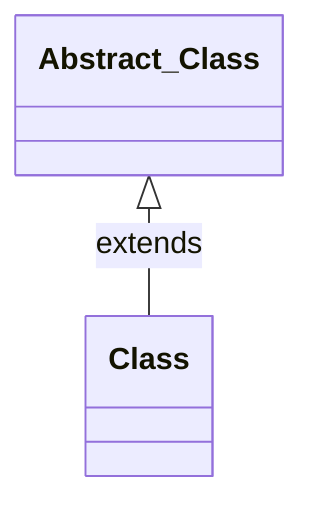

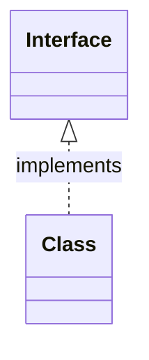

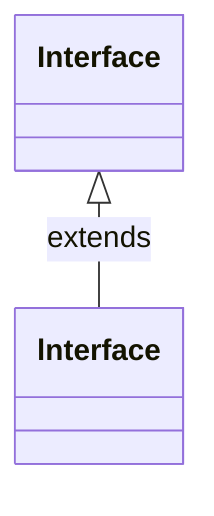

- **`interface`**’lerin gövdeleri, implemente edilecek sınıfın içinde yazılır.

**`interface`** tanımlarını oluştururken içinde yalnızca metot imzaları yazılır:

```java
public interface InterfaceName {
  void method1();
  void method2();
  void method3();
}
```

Ardından bu interface’i implemente edecek sınıfın içinde yazılır:

```java
public class ClassName implements InterfaceName {

	@Override
	public void method1() {
		// do same thing
	}

	@Override
	public void method2() {
		// do same thing
	}

	@Override
	public void method3() {
		// do same thing
	}
}
```

- Tanımladığımız **`interface`** ’i, birden fazla sınıf implemente ederek kullanabilir.

```java
public class ClassName implements InterfaceName1, InterfaceName2{
  // method signatures and field
}
```

- Bir sınıf hem **`interface`** implemente edebilir hem de aynı zamanda başka bir sınıftan kalıtım alabilir:

```java
public public class ClassName1 extends ClassName2 implements InterfaceName{
  // method signatures and field
}
```

- **`interface`** biden fazla **`interface` ’**ten kalıtım alabilir.

```java
public interface interface1 extends interface2, interface3 {
  // method signatures and field
}
```

- Bir sınıf bir **`interface`** ’i implemente ettiği zaman onun içindeki imzaları için ve eğer bu **`interface`** başka bir **`interface`** ten kalıtım aldıysa, aldığı tüm **`interface`**’lerin imzaları için de metotlar tanımlaması gerek.

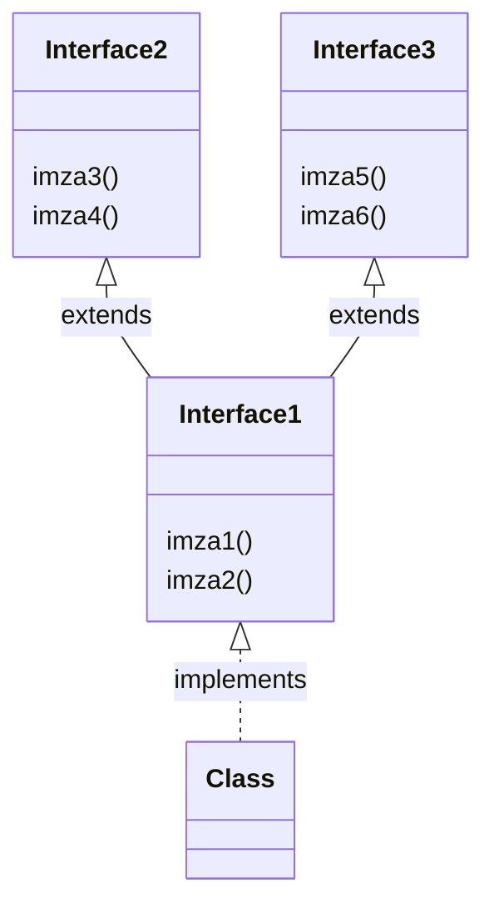

```java
public interface interface1 extends interface2, interface3 {
	void imza1();
	void imza2();
}
public interface interface2 {
	void imza3();
	void imza4();
}
public interface interface3 {
	void imza5();
	void imza6();
}
public class Class implements interface1{
	public void imza1() {}
	public void imza2() {}
	public void imza3() {}
	public void imza4() {}
	public void imza5() {}
	public void imza6() {}
}
```

## Örnek

Bir otomatik sürüş teknolojisi geliştiren araba firması, kendi kendine hareket edebilen arabalar için bir sistem kurmak istiyor. Bu arabalar, yapay zeka kullanarak konumlarını belirleyebiliyor ve verilen enlem (lat) ve boylam (lot) katsayılarıyla hareket edebiliyor. Sistem için gerekli **`interface`**'ler ve sınıflar aşağıdaki UML diyagramında belirtilmiştir.

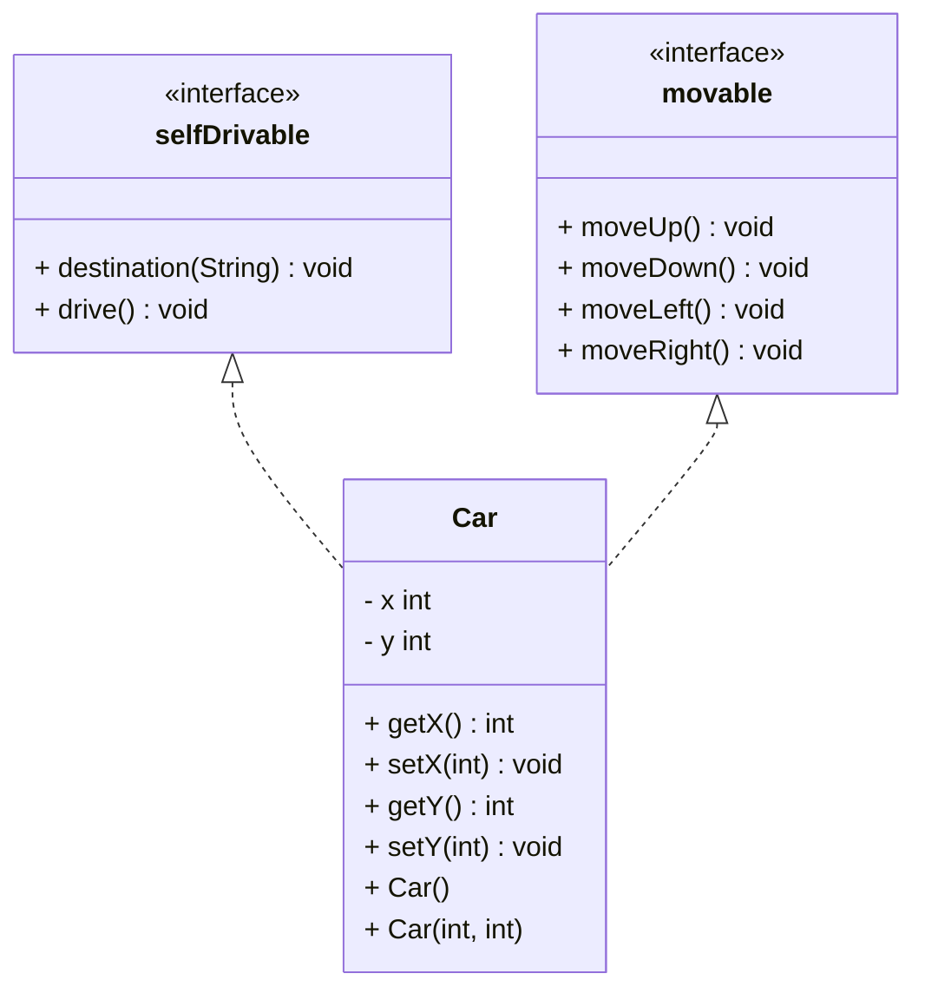

İlk önce **`interface`**’leri tanımlayalım:

### selfDrivable Interface

```java
interface selfDrivable {
	void destination(String d); // string olarak lat ve lot bilgilerini alacaktır
	void drive(); // araba hareket etmek için kullanılacaktır
}
```

### movable Interface

```java
interface movable {
	void moveUp(); // yukarıya hareket et
	void moveDown(); // aşağı hareket et
	void moveLeft(); // sola hareket et
	void moveRight(); // sağa hareket et
}
```

Daha sonra `Car` sınıfını oluşturalım, içinde `x` ve `y`  isimli `int` tipinde değişkenler olacak oda arabanın hangi yöne gideceğini belirtmek için kullanılacak. 

### Car Sınıfı

```java
class Car {
	private int x, y;
}
```

Ardından bu `x` ve `y` değişkenleri için `getter` ve `setter` metotlarını tanımlayalım, daha önce anlatıldığı gibi onları otomatik olarak oluşturabiliriz, unuttuysan  **`[tıkla](https://www.notion.so/Java-Programlama-21b3cd87c17c4fe5b29082cd7d32eb68?pvs=21)`**  ):

```java
class Car {
	private int x, y;

	**public int getX() {
		return x;
	}

	public void setX(int x) {
		this.x = x;
	}

	public int getY() {
		return y;
	}

	public void setY(int y) {
		this.y = y;
	}**
}
```

UML diyagramında gördüğümüz gibi iki adet constructor mevcuttur, biri parametresiz diğeri `x` ve `y` değerlerini parametre olarak alır:

```java
class Car {
	private int x, y;
	
	**public Car() {
		
	}

	public Car(int x, int y) {
		this.x = x;
		this.y = y;
	}**
	
	public int getX() {
		return x;
	}

	public void setX(int x) {
		this.x = x;
	}

	public int getY() {
		return y;
	}

	public void setY(int y) {
		this.y = y;
	}
}
```

Tanımlamaları bitirdikten sonra şimdi **`interface`**’leri implemente etme zamanı geldi: 

```java
⚠️class Car implements **movable, selfDrivable** {
		private int x, y;
	
		public Car() {
	
		}
	
		public Car(int x, int y) {
			this.x = x;
			this.y = y;
		}
	
		public int getX() {
			return x;
		}
	
		public void setX(int x) {
			this.x = x;
		}
	
		public int getY() {
			return y;
		}
	
		public void setY(int y) {
			this.y = y;
		}
	}
```

İmplemente ettiğimiz **`interface`**’lerin imzaları için gövdeleri yazmadığımız için compiler otomatik olarak hata verecektir. Bu yüzden her imza için bir gövde tanımlamam gerek.

```java
class Car implements movable, selfDrivable {
	private int x, y;

	public Car() {

	}

	public Car(int x, int y) {
		this.x = x;
		this.y = y;
	}

	**@Override
	public void moveUp() {
		y--;
	}

	@Override
	public void moveDown() {
		y++;
	}

	@Override
	public void moveLeft() {
		x--;
	}

	@Override
	public void moveRight() {
		x++;
	}

	@Override
	public void destination(String d) {
		System.out.println("Destination = " + d);
	}

	@Override
	public void drive() {
		System.out.println("Dirve");
	}**

	public int getX() {
		return x;
	}

	public void setX(int x) {
		this.x = x;
	}

	public int getY() {
		return y;
	}

	public void setY(int y) {
		this.y = y;
	}
}
```

Şimdi main metodunda kullanmaya başlayalım:

### Main Metodu

```java
public static void main(String[] args) {
	Car car = new Car();
	car.destination("39.878805935007165,33.44799553728058");
}
```

### Çıktısı

```java
Destination = 39.878805935007165,33.44799553728058
```

Peki eğer `Car` ile değil `selfDrivable` **`interface`** kullanarak `Car` nesnesini oluşturursak ne olur:

```java
public static void main(String[] args) {
	selfDrivable car = new Car();
	car.destination("39.878805935007165,33.44799553728058");
}
```

Doğru bir şekilde çalışır ancak dikkatlice bakarsak eğer `selfDrivable` **`interface`**'i kullanarak nesne oluşturursak diğer **`interface`**'lere ait metotları kullanamayız.

```java
	public static void main(String[] args) {
		selfDrivable car = new Car();
⚠️		car.moveDown(); //The method moveDown() is undefined for the type selfDrivable
	}
```

Bu sorunu çözmek için daha önce bahsettiğimiz cast yöntemini kullanmamız gerek:

```java
public static void main(String[] args) {
	selfDrivable car = new Car();
	((Car)car).moveDown();
}
```

### Ufak Bilgi

Biz bu sınıfta `x` değişkenine hiçbir değer atamadık, atamadan `moveRight()` metodunda arttırdık. Peki bu hata mı verecek, doğru mu çalışacak. Gelin yazdıralım bakalım (:

```java
@Override
public void moveRight() {
	x++;
	System.out.println(x);
}
```

`Car` sınıfındaki metodu bu şekilde yazdıktan sonra main metodunda kullanalım:

```java
public static void main(String[] args) {
	selfDrivable car = new Car();
	((Car)car).moveRight();
}
```

Çıktısı:

```java
1
```

Çıktısı 1 olmasının sebebi ise biz ona bir değer atamadık ancak kendisi `local` bir değişken olduğu için varsayılan değer 0. `moveRight()` metodunda arttırdığımız için 1 olmuştur.


